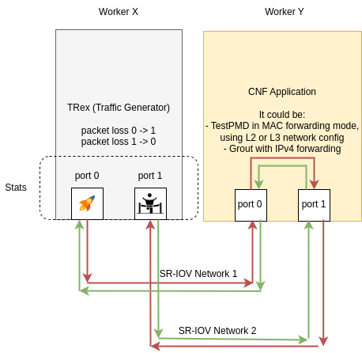

# Example CNF

[](https://github.com/openshift-kni/example-cnf/actions/workflows/push.yaml)

Example CNF is an OpenShift workload to exercice an SRIOV setup, based on [TestPMD](https://doc.dpdk.org/guides/testpmd_app_ug/intro.html) for traffic forwarding and [TRex](https://trex-tgn.cisco.com/) for traffic generation, such as the following:



It provides the following operators:

- [trex-operator](trex-operator)
- [testpmd-operator](testpmd-operator)
- [cnf-app-mac-operator](cnf-app-mac-operator)

You can use them from the [Example CNF Catalog](https://quay.io/repository/rh-nfv-int/nfv-example-cnf-catalog?tab=tags). Image generation is automated with [Github workflows](.github/workflows) in this repo, using this [Makefile](Makefile).

## Pre-requirements

To run Example CNF, you need to fulfil the following infrastructure-related pre-requirements:

- OpenShift cluster with +3 worker nodes.
- SR-IOV network operator.
- SriovNetworkNodePolicy and SriovNetwork CRDs.
- Proper configuration in network devices to match the SR-IOV resources definition.
- Performance Profile (Hugepages, CPU Isolation, etc.)

## How operators are created

The three operators defined in this repository are built with [Operator SDK tool](https://sdk.operatorframework.io/docs/building-operators/). [Here](https://youtu.be/imF9VGJ1Dd4) you can see how CRD-to-pod conversion works for this kind of operators.

We can differentiate between these two cases:

- Ansible-based operators: this is the case of [testpmd-operator](testpmd-operator/README.md#how-to-build-the-operator) and [trex-operator](trex-operator/README.md#how-to-build-the-operator).
- Go-based operators: this is the case of [cnf-app-mac-operator](cnf-app-mac-operator/README.md#how-to-build-the-operator).

## Pod affinity rules

There are some affinity rules for the deployed pods. In particular, `trexconfig-<x>` and `testpmd-app-<x>` pods are placed in different worker nodes.

## SRIOV networks

SRIOV networks are required for the setup. In our case, we are using a different SRIOV network per connection, using a different VLAN for each network.

In our [example-cnf-config automation](https://github.com/dci-labs/example-cnf-config/tree/master), in the [pre-run stage](https://github.com/dci-labs/example-cnf-config/blob/master/testpmd/hooks/pre-run.yml), we are setting the following networks:

```
    ecd_sriov_networks:
      - name: example-cnf-net1
        count: 1
      - name: example-cnf-net2
        count: 1
```

The `ecd_sriov_networks` represents the connection between TRex and CNF Application. There are two links per connection, each link using a different SRIOV network.

TRex uses static MAC addresses starting with `20:...`, and the CNF Application uses static MAC addresses starting with `80:...`, and the addresses, together with the PCI addresses, are eventually gathered by the CNFAppMac CR.

The network schema would be as follows:

```
TRex -- (example-cnf-net1|2) -- CNF Application
```

## Traffic Flow

Traffic flow is the following:

- TRex (Traffic Generator) generates and sends traffic from Port 0 to the CNF Application.

- The CNF Application receives incoming traffic from TRex on one of its ports.

- The CNF Application processes the received traffic and passes it back to TRex for evaluation, using the TestPMD MAC forwarding mode.

- TRex receives the processed traffic on Port 1.

- TRex calculates statistics by comparing the incoming traffic on Port 1 (processed traffic) with the outgoing traffic on Port 0 (original traffic sent by TRex) and vice versa.

## Testing

Please refer to [the testing docs](documentation/testing.md) to check how to test Example CNF using [Distributed-CI (DCI)](https://docs.distributed-ci.io/).

## Network troubleshooting

Apart from the logs offered by the resources deployed by Example CNF, the `ip` command can also offer some useful network information regarding the statistics of the network interfaces used in the tests.

For example, by accessing to the worker node where the resources are deployed, and checking the interface where the VFs are created, you can see information like this:

```
$ ip -s -d link show dev ens2f0
6: ens2f0: <BROADCAST,MULTICAST,UP,LOWER_UP> mtu 9000 qdisc mq state UP mode DEFAULT group default qlen 1000
    link/ether 3c:fd:fe:bb:1e:10 brd ff:ff:ff:ff:ff:ff promiscuity 0 minmtu 68 maxmtu 9702 addrgenmode none numtxqueues 80 numrxqueues 80 gso_max_size 65536 gso_max_segs 65535 tso_max_size 65536 tso_max_segs 65535 gro_max_size 65536 portid 3cfdfebb1e10 parentbus pci parentdev 0000:37:00.0
    RX:  bytes packets errors dropped  missed   mcast
        670348    9563      0       0       0    3372
    TX:  bytes packets errors dropped carrier collsns
        225778    1382      0       0       0       0
    vf 0     link/ether 92:be:3c:24:4a:7d brd ff:ff:ff:ff:ff:ff, spoof checking on, link-state auto, trust off
    RX: bytes  packets  mcast   bcast   dropped
        519160     6565       0    6565        0
    TX: bytes  packets   dropped
             0        0        0
    vf 1     link/ether be:c8:8b:88:a2:15 brd ff:ff:ff:ff:ff:ff, spoof checking on, link-state auto, trust off
    RX: bytes  packets  mcast   bcast   dropped
        505712     6392       0    6392        0
    TX: bytes  packets   dropped
             0        0        0
    vf 2     link/ether 7a:e8:f7:1d:5c:cc brd ff:ff:ff:ff:ff:ff, spoof checking on, link-state auto, trust off
    RX: bytes  packets  mcast   bcast   dropped
        519160     6565       0    6565        0
    TX: bytes  packets   dropped
             0        0        0
    vf 3     link/ether 5e:c2:8b:ef:87:a4 brd ff:ff:ff:ff:ff:ff, spoof checking on, link-state auto, trust off
    RX: bytes  packets  mcast   bcast   dropped
        346464     4374       0    4374        0
    TX: bytes  packets   dropped
             0        0        0
    vf 4     link/ether 9a:40:99:d1:cd:32 brd ff:ff:ff:ff:ff:ff, spoof checking on, link-state auto, trust off
    RX: bytes  packets  mcast   bcast   dropped
        408944     5177       0    5177        0
    TX: bytes  packets   dropped
             0        0        0
    vf 5     link/ether da:a7:e7:e6:b8:79 brd ff:ff:ff:ff:ff:ff, spoof checking on, link-state auto, trust off
    RX: bytes  packets  mcast   bcast   dropped
        519160     6565       0    6565        0
    TX: bytes  packets   dropped
             0        0        0
    vf 6     link/ether 2a:1e:c7:55:18:60 brd ff:ff:ff:ff:ff:ff, spoof checking on, link-state auto, trust off
    RX: bytes  packets  mcast   bcast   dropped
        519160     6565       0    6565        0
    TX: bytes  packets   dropped
             0        0        0
    vf 7     link/ether 86:79:8c:3f:b2:5b brd ff:ff:ff:ff:ff:ff, spoof checking on, link-state auto, trust off
    RX: bytes  packets  mcast   bcast   dropped
        519160     6565       0    6565        0
    TX: bytes  packets   dropped
             0        0        0
    vf 8     link/ether ce:7c:63:c0:fc:c4 brd ff:ff:ff:ff:ff:ff, spoof checking on, link-state auto, trust off
    RX: bytes  packets  mcast   bcast   dropped
        519160     6565       0    6565        0
    TX: bytes  packets   dropped
             0        0        0
    vf 9     link/ether ea:b3:47:1c:e4:d9 brd ff:ff:ff:ff:ff:ff, spoof checking on, link-state auto, trust off
    RX: bytes  packets  mcast   bcast   dropped
        505968     6396       0    6396        0
    TX: bytes  packets   dropped
             0        0        0
    vf 10     link/ether 66:6e:b8:01:df:4d brd ff:ff:ff:ff:ff:ff, spoof checking on, link-state auto, trust off
    RX: bytes  packets  mcast   bcast   dropped
        519160     6565       0    6565        0
    TX: bytes  packets   dropped
             0        0        0
    vf 11     link/ether b2:ed:fb:92:67:1d brd ff:ff:ff:ff:ff:ff, spoof checking on, link-state auto, trust off
    RX: bytes  packets  mcast   bcast   dropped
        519160     6565       0    6565        0
    TX: bytes  packets   dropped
             0        0        0
    vf 12     link/ether 96:37:81:12:30:83 brd ff:ff:ff:ff:ff:ff, spoof checking on, link-state auto, trust off
    RX: bytes  packets  mcast   bcast   dropped
        519160     6565       0    6565        0
    TX: bytes  packets   dropped
             0        0        0
    vf 13     link/ether 02:1d:21:a3:81:e4 brd ff:ff:ff:ff:ff:ff, spoof checking on, link-state auto, trust off
    RX: bytes  packets  mcast   bcast   dropped
        346336     4372       0    4372        0
    TX: bytes  packets   dropped
             0        0        0
    vf 14     link/ether c2:76:dd:b0:03:60 brd ff:ff:ff:ff:ff:ff, spoof checking on, link-state auto, trust off
    RX: bytes  packets  mcast   bcast   dropped
        519160     6565       0    6565        0
    TX: bytes  packets   dropped
             0        0        0
    vf 15     link/ether 3a:24:a8:4a:9b:75 brd ff:ff:ff:ff:ff:ff, spoof checking on, link-state auto, trust off
    RX: bytes  packets  mcast   bcast   dropped
        430208     5435       0    5435        0
    TX: bytes  packets   dropped
             0        0        0
    altname enp55s0f0
```

## Utils

Under [utils](utils) folder, you can find some utilities included in Example CNF to extend the functionalities offered by the tool.

## Acknowledgements

Please write to telcoci@redhat.com in case you need more information for using and testing Example CNF in the scenarios that have been proposed in this repository.
