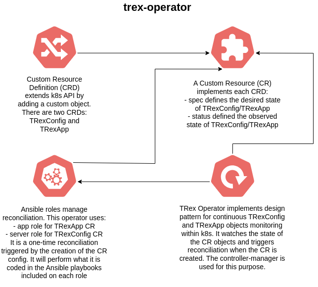
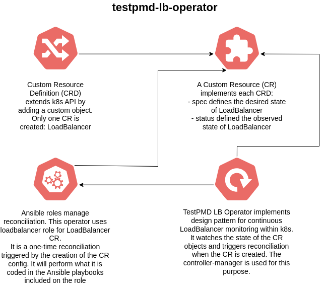
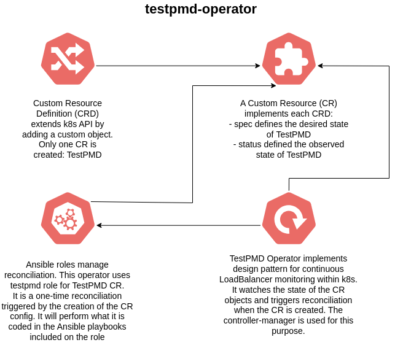
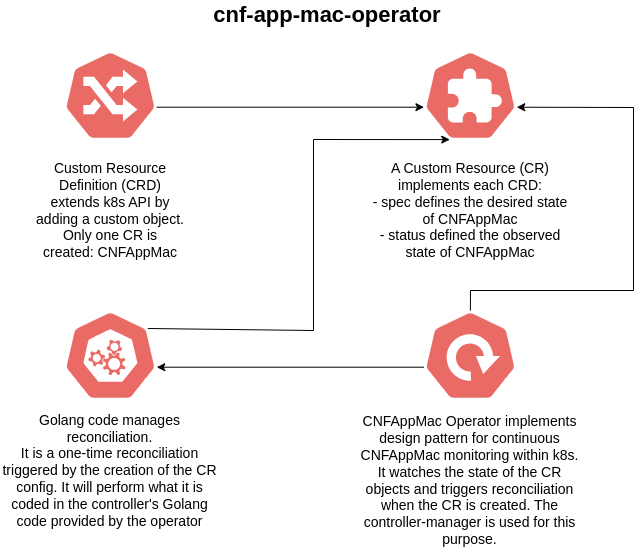
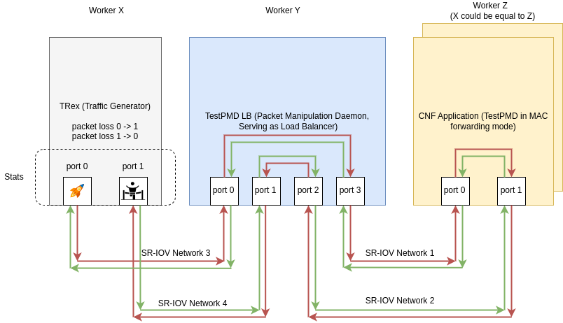
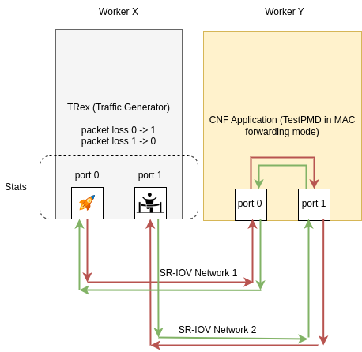

Example CNF
==============

[](https://github.com/openshift-kni/example-cnf/actions/workflows/push.yaml)

Example CNF is an OpenShift workload to exercice an SRIOV setup, such as the following:


It is providing the following operators:

* trex-operator
    * It provides TRex Traffic Generator, decomposed in three components:
        * TRexConfig CR, pinning the config of the TRex server instance. Related pod is `trexconfig-<x>` pod.
        * TRexApp CR, setting up the job that launches TRex execution to generate traffic towards the system under test. Related pod is `trex-app` pod.
        * TRex Operator, ensuring CR reconciliation via controller-manager pod. Related pod is `trex-operator-controller-manager-<x>` pod.
    * Following information can be extracted from pod logs:
        * In `trexconfig-<x>` pod logs, you can see the trex statistics printed periodically.
        * The summary of the test execution can be seen at the end of the `trex-app` job logs.
        * In `trex-operator-controller-manager-<x>` pod, you can see the execution of the Ansible playbooks that ensures the reconciliation loop of the operator.



* testpmd-lb-operator
    * It represents a modified TestPMD (Packet Manipulation Daemon) instance, called TestPMD LoadBalancer (LB), implementing a custom load balancing forwarding module, using two components:
        * LoadBalancer CR, creating the pod that perform load balancing between its ports. Related pod is `loadbalancer-<x>` pod. This pod is composed by two containers: `loadbalancer`, which performs the load balancing forwarding, and `listener`, an auxiliary module that is listening to the CNFAppMac component created by the cnf-app-mac-operator to retrieve the MAC addresses of the TestPMD instances launched by the testpmd-operator (i.e. the CNF Application), then serving this information to the `loadbalancer` container.
        * TestPMD LB Operator, ensuring CR reconciliation via controller-manager pod. Related pod is `testpmd-lb-operator-controller-manager-<x>` pod.
    * Following information can be extracted from pod logs:
        * To see the TestPMD LB statistics printed periodically for this module, you can rely on `loadbalancer-<x>` pod logs (which prints `loadbalancer` container logs).
        * In `testpmd-lb-operator-controller-manager-<x>` pod, you can see the execution of the Ansible playbooks that ensures the reconciliation loop of the operator.
    * The LoadBalancer is not currently replicated; only one instance is deployed. It's supposed that, up to now, it's not belonging to any update-upgrade process of the example-cnf, so that it has to be deployed in an isolated worker node, whereas the other components of this CNF (TRex and CNF Application) have to be deployed in a different worker node. Pod anti-affinity rules ensure this setup.



* testpmd-operator
    * Final application, also known as CNF Application, which is a standard TestPMD instance using the default MAC forwarding module. It uses two components:
        * TestPMD CR, which creates replicated pods to implement the MAC forwarding module as final application. Related pods are `testpmd-app-<x>` pods.
        * TestPMD Operator, ensuring CR reconciliation via controller-manager pod. Related pod is `testpmd-operator-controller-manager-<x>` pod.
    * Following information can be extracted from pod logs:
        * To see the TestPMD statistics printed periodically for this module, you can rely on `testpmd-app-<x>` pod logs. Each log will offer you the statistics of each replica pod.
        * In `testpmd-operator-controller-manager-<x>` pod, you can see the execution of the Ansible playbooks that ensures the reconciliation loop of the operator.



* cnf-app-mac-operator
    * Auxiliary operator just composed by one component, which is CNFAppMac Operator, a Golang-based operator in charge of ensuring reconciliation for CNFAppMac CR, which is a wrapper created for each `testpmd-app-<x>` and linked to them, and that are used to extract the network information of these pods (network, MAC and PCI addresses), to be offered to other components of the solution, such as the `listener` contaoner deployed by TestPMD LB.



You can use them from the [Example CNF Catalog](https://quay.io/repository/rh-nfv-int/nfv-example-cnf-catalog?tab=tags).

How operators are created
------------------------

The four operators defined in this repository are built with [Operator SDK tool](https://sdk.operatorframework.io/docs/building-operators/).

We can differentiate between these two cases:

**Ansible-based operators:**

This is the case of testpmd-operator, trex-operator and testpmd-lb-operator.

Base structure for each case is achieved with the following commands, then it's just a matter of accommodating the required code for each operator in the corresponding files and folders:

- testpmd-operator

```
$ mkdir testpmd-operator; cd testpmd-operator
$ operator-sdk init --domain openshift.io --plugins ansible
$ operator-sdk create api --version v1 --generate-role --group examplecnf --kind TestPMD
```

- trex-operator

```
$ mkdir trex-operator; cd trex-operator
$ operator-sdk init --domain openshift.io --plugins ansible
$ operator-sdk create api --version v1 --generate-role --group examplecnf --kind TRexApp
$ operator-sdk create api --version v1 --generate-role --group examplecnf --kind TRexConfig
```

- testpmd-lb-operator

```
$ mkdir testpmd-lb-operator; cd testpmd-lb-operator
$ operator-sdk init --domain openshift.io --plugins ansible
$ operator-sdk create api --version v1 --generate-role --group examplecnf --kind LoadBalancer
```

**Go-based operators:**

This is the case of cnf-app-mac-operator.

Base structure for this case is achieved with the following commands, then it's just a matter of accommodating the required code for the operator in the corresponding files and folders:

- cnf-app-mac-operator

For operator-sdk v1.33.0, you need to have installed the same Go version used in operator-sdk, which is go 1.22.5.

```
$ operator-sdk version
operator-sdk version: "v1.33.0", commit: "542966812906456a8d67cf7284fc6410b104e118", kubernetes version: "1.27.0", go version: "go1.21.5", GOOS: "linux", GOARCH: "amd64"
```

Create the project structure and the CNFAppMac API:

```
$ mkdir cnf-app-mac-operator; cd cnf-app-mac-operator
$ operator-sdk init --domain openshift.io --repo github.com/openshift-kni/example-cnf/tree/main/cnf-app-mac-operator
$ operator-sdk create api --version v1 --group examplecnf --kind CNFAppMac --controller --resource
```

At this point, remove RBAC resource creation in Makefile > manifests task. Then, review cmd/main.go and api/v1/cnfappmac_types.go, then run:

```
$ make generate
$ make manifests 
```

Create webhook and certmanager:

```
$ operator-sdk create webhook --version v1 --group examplecnf --kind CNFAppMac --defaulting --programmatic-validation
```

Review the generated files properly, then:

```
$ make manifests
```

Comment webhook references in PROJECT and cmd/main.go files (older versions were not using this), review internal/controller/cnfappmac_controller.go and review the rest of files.

To conclude, build the main.go file to check it's working fine:

```
$ go build cmd/main.go
```

Ansible based automation
------------------------

You can use the Ansible playbooks and roles at <https://github.com/rh-nfv-int/nfv-example-cnf-deploy> to automate the use of the Example CNF.

Load balancer mode vs. direct mode
------------------------

There are two different ways of deploying example-cnf, depending on the `enable_lb` flag (default to `true`):

- Load balancer mode (`enable_lb: true`):
    - Represents the behavior described above, with TestPMD LB acting as load balancer between TRex and the CNF Application.
- Direct mode (`enable_lb: false`):
    - The TestPMD LB instance is not used, then testpmd-lb-operator is not deployed.
    - In this case, there's a direct connection between TRex and CNF Application.
    - The CNF Application only uses one replica pod, instead of two.

Pod affinity rules
------------------------

There are different, possible affinity rules for the deployed pods, depending whether testpmd-lb-operator is deployed (load balancer mode) or not (direct mode):

- Load balancer mode:
    - The `loadbalancer-<x>` pod is deployed in a different worker than `trexconfig-<x>` and `testpmd-app-<x>`.
    - There are no constraints for the location of `trexconfig-<x>` and `testpmd-app-<x>` pods, so they may live in the same worker.
- Direct mode:
    - Since load balancer is not used, in this scenario, `trexconfig-<x>` and `testpmd-app-<x>` pods are placed in different worker nodes.

SRIOV networks
------------------------

SRIOV networks are required for the setup. In our case, we are using a different SRIOV network per connection, using a different VLAN for each network.

In our [example-cnf-config automation](https://github.com/dci-labs/example-cnf-config/tree/master), according to [these two variables](https://github.com/dci-labs/example-cnf-config/blob/master/testpmd/hooks/pre-run.yml#L3-L15), we are setting the following networks:

```
    cnf_app_networks:
      - name: intel-numa0-net1
        count: 1
      - name: intel-numa0-net2
        count: 1
    packet_generator_networks:
      - name: intel-numa0-net3
        count: 1
      - name: intel-numa0-net4
        count: 1
```

The `cnf_app_networks` represents the connection between TestPMD LB and CNF Application, and `packet_generator_networks` represents the connection between TRex and TestPMD LB. There are two links per connection, each link using a different SRIOV network.

According to the configuration applied in example-cnf hooks, and also depending on the mode in which example-cnf is launched, the distribution of these two SRIOV networks may be different:

**Load balancer mode:**

According to [this code](https://github.com/rh-nfv-int/nfv-example-cnf-deploy/blob/master/roles/example-cnf-app/tasks/app.yaml#L60-L74):

```
- name: create packet gen network list for lb with hardcoded macs
  set_fact:
    pack_nw: "{{ pack_nw + [ item | combine({ 'mac': lb_gen_port_mac_list[idx:idx+item.count] }) ] }}"
  loop: "{{ packet_generator_networks }}"
  loop_control:
    index_var: idx

- name: create cnf app network list for lb with hardcoded macs
  set_fact:
    cnf_nw: "{{ cnf_nw + [ item | combine({ 'mac': lb_cnf_port_mac_list[idx:idx+item.count] }) ] }}"
  loop: "{{ cnf_app_networks }}"
  loop_control:
    index_var: idx
```

- `pack_nw` corresponds to `packet_generator_networks` and uses `lb_gen_port_mac_list`, having two MAC addresses starting with `40:...`, and correspond to the interfaces that connect the TestPMD LB with TRex. It uses `intel-numa0-net3|4` networks.
- `cnf_nw` corresponds to `cnf_app_networks` and uses `lb_cnf_port_mac_list`, having two MAC addresses starting with `60:...`, and correspond to the interfaces that connect the TestPMD Load Balancer with the CNF Application. It uses `intel-numa0-net1|2` networks.

Also, note that TRex uses static MAC addresses starting with `20:...`. The only MAC addresses that are created dynamically are the ones from CNF Application. To capture them, CNFAppMac CR is used, which saves the MAC and PCI addresses from the CNF Application pods and serve them to the other components of the architecture.

So, network schema is as follows (which was already depicted in the flow diagram):

```
TRex -- (intel-numa0-net3|4) -- TestPMD LB -- (intel-numa0-net1|2) -- CNF Application
```

**Direct mode:**

In this case, the network used by TRex varies, according to [this code](https://github.com/rh-nfv-int/nfv-example-cnf-deploy/blob/master/roles/example-cnf-app/tasks/trex/app.yaml#L5): `packet_gen_net: "{{ packet_generator_networks if enable_lb|bool else cnf_app_networks }}"`

This says that, if load balancer is not enabled, then TRex is connected to the `cnf_app_networks`, which is, in fact, `intel-numa0-net1|2`, so it doesn't use `intel-numa0-net3|4` in this case.

Similarly to the load balancing case, TRex uses static MAC addresses starting with `20:...`, and the CNF Application uses random MAC addresses which are eventually provided, together with the PCI addresses, by the CNFAppMac CR.

The network schema would be as follows:

```
TRex -- (intel-numa0-net1|2) -- CNF Application
```

Traffic Flow
------------------------

**Load balancer mode:**

Here, we will depict the traffic flow for the case of the load balancer mode, including the SRIOV setup already described above. Diagram above represents the data plane traffic.



Traffic flow is the following (just considering one replica pod from the CNF Application as target, but the same flow applies to all CNF Application replicas deployed in the scenario):

- TRex (Traffic Generator) generates and sends traffic from Port 0 to TestPMD LB.

- TestPMD LB, configured as a load balancer, receives incoming traffic on Ports 0 and 1.

- TestPMD LB load balances the incoming traffic between its Ports 2 and 3.

- TestPMD LB forwards the load-balanced traffic to the CNF Application.

- The CNF Application receives incoming traffic from TestPMD LB on one of its ports.

- The CNF Application processes the received traffic and passes it back to TRex for evaluation, using the TestPMD MAC forwarding mode.

- TRex receives the processed traffic on Port 1 (previously forwarded by TestPMD LB).

- TRex calculates statistics by comparing the incoming traffic on Port 1 (processed traffic) with the outgoing traffic on Port 0 (original traffic sent by TRex) and vice versa.

This configuration simulates a traffic flow from TRex to TestPMD LB, then to the CNF Application, and finally back to TRex for evaluation. TestPMD LB serves as a load balancer to distribute traffic between its ports, and the CNF Application processes and loops back the traffic to TRex for analysis using the TestPMD MAC forwarding mode. TestPMD LB ensures zero traffic loss throughout the rolling update process.

**Direct mode:**

The direct mode case is a simplification of the load balancing mode. It's depicted in the following diagram, which also represents the data plane traffic:



Traffic flow is the following:

- TRex (Traffic Generator) generates and sends traffic from Port 0 to the CNF Application.

- The CNF Application receives incoming traffic from TRex on one of its ports.

- The CNF Application processes the received traffic and passes it back to TRex for evaluation, using the TestPMD MAC forwarding mode.

- TRex receives the processed traffic on Port 1.

- TRex calculates statistics by comparing the incoming traffic on Port 1 (processed traffic) with the outgoing traffic on Port 0 (original traffic sent by TRex) and vice versa.


Network troubleshooting
------------------------

Apart from the logs offered by the resources deployed by example-cnf, the `ip` command can also offer some useful network information regarding the statistics of the network interfaces used in the tests.

For example, by accessing to the worker node where the resources are deployed, and checking the interface where the VFs are created, you can see information like this:

```
$ ip -s -d link show dev ens2f0
6: ens2f0: <BROADCAST,MULTICAST,UP,LOWER_UP> mtu 9000 qdisc mq state UP mode DEFAULT group default qlen 1000
    link/ether 3c:fd:fe:bb:1e:10 brd ff:ff:ff:ff:ff:ff promiscuity 0 minmtu 68 maxmtu 9702 addrgenmode none numtxqueues 80 numrxqueues 80 gso_max_size 65536 gso_max_segs 65535 tso_max_size 65536 tso_max_segs 65535 gro_max_size 65536 portid 3cfdfebb1e10 parentbus pci parentdev 0000:37:00.0
    RX:  bytes packets errors dropped  missed   mcast
        670348    9563      0       0       0    3372
    TX:  bytes packets errors dropped carrier collsns
        225778    1382      0       0       0       0
    vf 0     link/ether 92:be:3c:24:4a:7d brd ff:ff:ff:ff:ff:ff, spoof checking on, link-state auto, trust off
    RX: bytes  packets  mcast   bcast   dropped
        519160     6565       0    6565        0
    TX: bytes  packets   dropped
             0        0        0
    vf 1     link/ether be:c8:8b:88:a2:15 brd ff:ff:ff:ff:ff:ff, spoof checking on, link-state auto, trust off
    RX: bytes  packets  mcast   bcast   dropped
        505712     6392       0    6392        0
    TX: bytes  packets   dropped
             0        0        0
    vf 2     link/ether 7a:e8:f7:1d:5c:cc brd ff:ff:ff:ff:ff:ff, spoof checking on, link-state auto, trust off
    RX: bytes  packets  mcast   bcast   dropped
        519160     6565       0    6565        0
    TX: bytes  packets   dropped
             0        0        0
    vf 3     link/ether 5e:c2:8b:ef:87:a4 brd ff:ff:ff:ff:ff:ff, spoof checking on, link-state auto, trust off
    RX: bytes  packets  mcast   bcast   dropped
        346464     4374       0    4374        0
    TX: bytes  packets   dropped
             0        0        0
    vf 4     link/ether 9a:40:99:d1:cd:32 brd ff:ff:ff:ff:ff:ff, spoof checking on, link-state auto, trust off
    RX: bytes  packets  mcast   bcast   dropped
        408944     5177       0    5177        0
    TX: bytes  packets   dropped
             0        0        0
    vf 5     link/ether da:a7:e7:e6:b8:79 brd ff:ff:ff:ff:ff:ff, spoof checking on, link-state auto, trust off
    RX: bytes  packets  mcast   bcast   dropped
        519160     6565       0    6565        0
    TX: bytes  packets   dropped
             0        0        0
    vf 6     link/ether 2a:1e:c7:55:18:60 brd ff:ff:ff:ff:ff:ff, spoof checking on, link-state auto, trust off
    RX: bytes  packets  mcast   bcast   dropped
        519160     6565       0    6565        0
    TX: bytes  packets   dropped
             0        0        0
    vf 7     link/ether 86:79:8c:3f:b2:5b brd ff:ff:ff:ff:ff:ff, spoof checking on, link-state auto, trust off
    RX: bytes  packets  mcast   bcast   dropped
        519160     6565       0    6565        0
    TX: bytes  packets   dropped
             0        0        0
    vf 8     link/ether ce:7c:63:c0:fc:c4 brd ff:ff:ff:ff:ff:ff, spoof checking on, link-state auto, trust off
    RX: bytes  packets  mcast   bcast   dropped
        519160     6565       0    6565        0
    TX: bytes  packets   dropped
             0        0        0
    vf 9     link/ether ea:b3:47:1c:e4:d9 brd ff:ff:ff:ff:ff:ff, spoof checking on, link-state auto, trust off
    RX: bytes  packets  mcast   bcast   dropped
        505968     6396       0    6396        0
    TX: bytes  packets   dropped
             0        0        0
    vf 10     link/ether 66:6e:b8:01:df:4d brd ff:ff:ff:ff:ff:ff, spoof checking on, link-state auto, trust off
    RX: bytes  packets  mcast   bcast   dropped
        519160     6565       0    6565        0
    TX: bytes  packets   dropped
             0        0        0
    vf 11     link/ether b2:ed:fb:92:67:1d brd ff:ff:ff:ff:ff:ff, spoof checking on, link-state auto, trust off
    RX: bytes  packets  mcast   bcast   dropped
        519160     6565       0    6565        0
    TX: bytes  packets   dropped
             0        0        0
    vf 12     link/ether 96:37:81:12:30:83 brd ff:ff:ff:ff:ff:ff, spoof checking on, link-state auto, trust off
    RX: bytes  packets  mcast   bcast   dropped
        519160     6565       0    6565        0
    TX: bytes  packets   dropped
             0        0        0
    vf 13     link/ether 02:1d:21:a3:81:e4 brd ff:ff:ff:ff:ff:ff, spoof checking on, link-state auto, trust off
    RX: bytes  packets  mcast   bcast   dropped
        346336     4372       0    4372        0
    TX: bytes  packets   dropped
             0        0        0
    vf 14     link/ether c2:76:dd:b0:03:60 brd ff:ff:ff:ff:ff:ff, spoof checking on, link-state auto, trust off
    RX: bytes  packets  mcast   bcast   dropped
        519160     6565       0    6565        0
    TX: bytes  packets   dropped
             0        0        0
    vf 15     link/ether 3a:24:a8:4a:9b:75 brd ff:ff:ff:ff:ff:ff, spoof checking on, link-state auto, trust off
    RX: bytes  packets  mcast   bcast   dropped
        430208     5435       0    5435        0
    TX: bytes  packets   dropped
             0        0        0
    altname enp55s0f0
```

Utils
------------------------

Under [utils](utils) folder, you can find some utilities included in example-cnf to extend the functionalities offered by the tool.

- [webserver.go](utils/webserver.go): a Golang-based webserver to implement liveness, readiness and startup probes in the container images offered in [testpmd-container-app](testpmd-container-app) and [trex-container-app](trex-container-app) folders. The Makefiles offered in these directories take care of copying the webserver code from the utils directory to each image's directory.
- [support-images](support_images): projects where you can find the Dockerfile required to build some of the images used as build images by the example-cnf images. These images can be found on quay.io/rh-nfv-int and they are publicly available, you only need credentials to access quay.io. The images can be built with the following commands (you need to run it in a RHEL host with a valid RHEL subscription to be able to download the packages installed in the images, and you need a valid quay.io credentials to push it to quay.io):

```
# build images
$ cd utils/support-images
$ podman build dpdk-19.11 -f dpdk-19.11/Dockerfile -t "quay.io/rh-nfv-int/dpdk-19.11:v0.0.1"
$ podman build dpdk-23.11 -f dpdk-23.11/Dockerfile -t "quay.io/rh-nfv-int/dpdk-23.11:v0.0.1"
$ podman build ubi8-base-testpmd -f ubi8-base-testpmd/Dockerfile -t "quay.io/rh-nfv-int/ubi8-base-testpmd:v0.0.1"
$ podman build ubi8-base-trex -f ubi8-base-trex/Dockerfile -t "quay.io/rh-nfv-int/ubi8-base-trex:v0.0.1"

# push images (to quay.io/rh-nfv-int)
$ podman push quay.io/rh-nfv-int/dpdk-19.11:v0.0.1
$ podman push quay.io/rh-nfv-int/dpdk-23.11:v0.0.1
$ podman push quay.io/rh-nfv-int/ubi8-base-testpmd:v0.0.1
$ podman push quay.io/rh-nfv-int/ubi8-base-trex:v0.0.1
```
