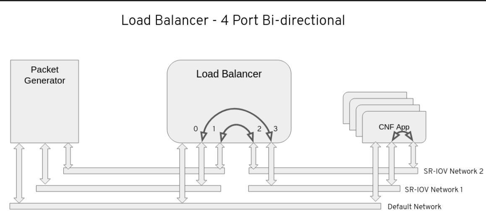
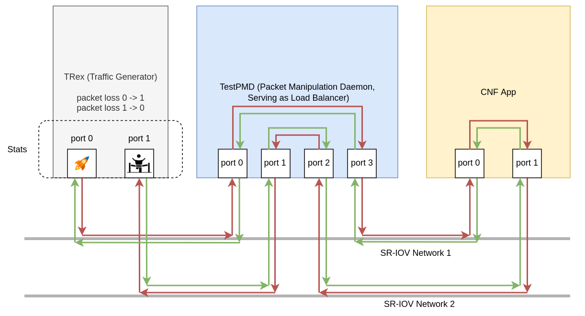

Example CNF
==============

Example CNF is an OpenShift workload to exercice an SRIOV setup.

It is providing the following operators:

* testpmd-operator
* trex-operator
* testpmd-lb-operator
* cnf-app-mac-operator

You can use them from the [Example CNF Catalog](https://quay.io/repository/rh-nfv-int/nfv-example-cnf-catalog?tab=tags).

Ansible based automation
------------------------

You can use the Ansible playbooks and roles at <https://github.com/rh-nfv-int/nfv-example-cnf-deploy> to automate the use of the Example CNF.

Traffic Flow
------------------------

Traffic Flow:

- TRex (Traffic Generator) generates and sends traffic from Port 0 to TestPMD.

- TestPMD (Packet Manipulation Daemon), configured as a load balancer, receives incoming traffic on Ports 0 and 1.

- TestPMD load balances the incoming traffic between its Ports 2 and 3.

- TestPMD forwards the load-balanced traffic to the CNF Application.

- The CNF Application receives incoming traffic from TestPMD on one of its ports.

- The CNF Application processes the received traffic and passes it back to TRex for evaluation.

- TRex receives the processed traffic on Port 1.

- TRex calculates statistics by comparing the incoming traffic on Port 1 (processed traffic) with the outgoing traffic on Port 0 (original traffic sent by TRex) and vice versa.

This configuration simulates a traffic flow from TRex to TestPMD, then to the CNF Application, and finally back to TRex for evaluation. TestPMD serves as a load balancer to distribute traffic between its ports, and the CNF Application processes and loops back the traffic to TRex for analysis. TestPMD LB ensures zero traffic loss throughout the rolling update process.

Utils
------------------------

Under [utils](utils) folder, you can find some utilities included in example-cnf to extend the functionalities offered by the tool.

- [webserver.go](utils/webserver.go): a Golang-based webserver to implement liveness, readiness and startup probes in the container images offered in [testpmd-container-app](testpmd-container-app) and [trex-container-app](trex-container-app) folders. The Makefiles offered in these directories take care of copying the webserver code from the utils directory to each image's directory; anyway, you have a local copy of the webserver code included on each image for the sake of completeness.
