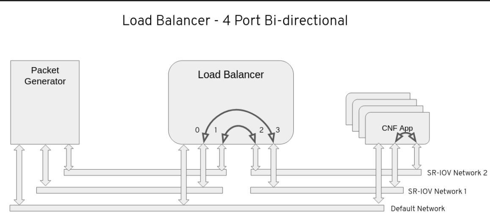

Example CNF
==============

Example CNF is an OpenShift workload to exercice an SRIOV setup.

It is providing the following operators:

* testpmd-operator
* trex-operator
* testpmd-lb-operator
* cnf-app-mac-operator

You can use them from the [Example CNF Catalog](https://quay.io/repository/rh-nfv-int/nfv-example-cnf-catalog?tab=tags).

Ansible based automation
------------------------

You can use the Ansible playbooks and roles at <https://github.com/rh-nfv-int/nfv-example-cnf-deploy> to automate the use of the Example CNF.
