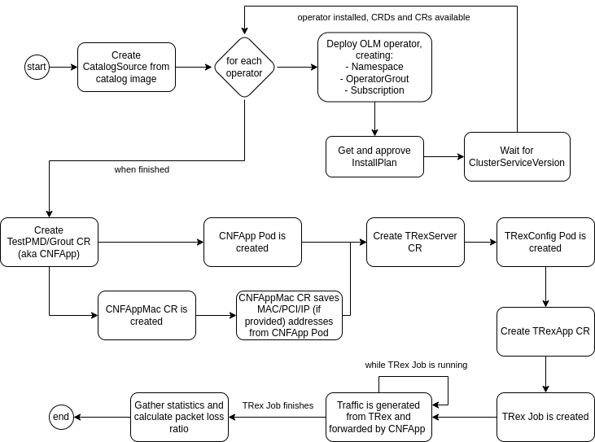

# Testing Example CNF

In this document, we will show you how to test Example CNF using [Distributed-CI (DCI)](https://docs.distributed-ci.io/).

For this to work, we will assume that we have an OCP cluster up and running that meets the [pre-requirements](../README.md#pre-requirements) to launch Example CNF, and that all DCI tools (`dci-openshift-agent`, `dci-openshift-app-agent` and `dci-pipeline`) are installed in a jumphost server which has access to the OCP cluster.

You can use the Ansible playbooks and roles from [example_cnf_deploy role](https://github.com/redhatci/ansible-collection-redhatci-ocp/blob/main/roles/example_cnf_deploy/README.md) to automate the use of the Example CNF.

> All test cases referenced in this documentation are supposed to be launched from stable code. If you need to test a PR created on this project or related projects (e.g. ansible-collection-redhatci-ocp), you can use [`dci-pipeline-check`](https://docs.distributed-ci.io/dci-pipeline/#dci-pipeline-check) instead. For this to work, if the change(s) to address include(s) a PR from this repository, you need to wait until the Github action that builds the example-cnf images finishes, else the DCI job will not use the code that you are proposing on the PR.

## Pipeline configuration

To deploy Example CNF, we will use [`dci-pipeline` tool](https://blog.distributed-ci.io/dci-pipeline.html), with the following pipeline configuration (this corresponds to the [baseline scenario](#baseline-scenario) we will present later on, but can be used as base for the rest of scenarios):

```
$ cat example-cnf-pipeline.yml
---
- name: example-cnf
  stage: workload
  prev_stages: [openshift-upgrade, openshift]
  ansible_cfg: /usr/share/dci-openshift-agent/ansible.cfg
  ansible_playbook: /usr/share/dci-openshift-app-agent/dci-openshift-app-agent.yml
  ansible_inventory: /etc/dci-openshift-app-agent/hosts.yml
  configuration: "myqueue"
  dci_credentials: ~/.config/dci-pipeline/credentials.yml
  ansible_extravars:
    dci_cache_dir: /var/lib/dci-pipeline
    dci_tags:
      - debug

    # Including example-cnf hooks
    dci_config_dir: /usr/share/example-cnf-config/testpmd
    dci_gits_to_components:
      - /usr/share/example-cnf-config

    # Do not delete resources when the job finishes
    dci_teardown_on_success: false
    dci_teardown_on_failure: false

    # Point to SRIOV config
    example_cnf_sriov_file: /usr/share/mycluster-sriov-config.yml

    # Tune example-cnf execution
    ## Allow testpmd in reduced mode
    ecd_testpmd_reduced_mode: 1
    ## Tune TRexApp parameters
    ecd_trex_duration: 120
    ecd_trex_packet_rate: 2mpps
    ecd_trex_packet_size: 64

    # Allow failures in TRex jobs in case we have packet loss because of the data rate we're generating
    example_cnf_skip_trex_job_failure: true

  use_previous_topic: true
  components:
    - nfv-example-cnf-index
  inputs:
    kubeconfig: kubeconfig_path
```

From this pipeline, we can extract the following information:

- Example CNF is launched on top of a running OpenShift cluster, using `dci-openshift-app-agent` as main Ansible automation.
- Example CNF hooks are downladed in the jumphost from [example-cnf-config](https://github.com/dci-labs/example-cnf-config/tree/master/testpmd) repository, under `/usr/share` folder.
- The deployment is not removed when the DCI job finishes.
- SRIOV config is provided in a YAML file like this one (previously, you would have needed to configure your network to match that configuration in your cluster, so that the worker node's interfaces have the given VLAN configured):
- With nfv-example-cnf-index DCI component, we will refer to the software to be used to download Example CNF-related images from Quay.io. Here, we are using the latest version currently available, since we're not pinning the version to use. Here's an example of a [nfv-example-cnf-index DCI component](https://www.distributed-ci.io/topics/b8454f14-ff58-41ad-b31c-00f9e84eff3c/components/fb503d17-57da-4e54-9095-6d2bdd858f24). The `Data` field contains the URL to reach the registry where the images are defined, and the image version is the same that the one used in the component (for this example, v0.3.7-202501202232.2eb6d6d).

```
$ cat mycluster-sriov-config.yml
---
sriov_network_configs:
  - resource: example_cnf_res1
    node_policy:
      name: example-cnf-policy1
      device_type: vfio-pci
      is_rdma: false
      mtu: 9000
      nic_selector:
        device_id: 158b
        pf_names:
          - ens7f0#0-7
        vendor: "8086"
      node_selector:
        node-role.kubernetes.io/worker: ""
      num_vfs: 16
      priority: 99
  - resource: example_cnf_res2
    node_policy:
      name: example-cnf-policy2
      device_type: vfio-pci
      is_rdma: false
      mtu: 9000
      nic_selector:
        device_id: 158b
        pf_names:
          - ens7f0#8-15
        vendor: "8086"
      node_selector:
        node-role.kubernetes.io/worker: ""
      num_vfs: 16
      priority: 99
  - resource: example_cnf_res1
    network:
      name: example-cnf-net1
      network_namespace: example-cnf
      spoof_chk: "off"
      trust: "on"
      vlan: 3801
      capabilities: '{"mac": true}'
  - resource: example_cnf_res2
    network:
      name: example-cnf-net2
      network_namespace: example-cnf
      spoof_chk: "off"
      trust: "on"
      vlan: 3802
      capabilities: '{"mac": true}'
```

- Fine tune the parameters for the tests to be launched. We can configure here the following:

  - `ecd_testpmd_reduced_mode`: default value is 0. If it's different than 0, it allows Example CNF to use the reduced mode in the [testpmd-wrapper](../testpmd-container-app/cnfapp/scripts/testpmd-wrapper) script, where only three cores are used on testpmd, and txd/rxd parameters are doubled.
  - `ecd_trex_duration`: default value is 120. It is the duration of the TRex run. If setting -1, TRex will run on continuous burst mode. If setting any value here, TRex job will be stopped once this time is reached. This may imply packet loss if using a high packet rate.
  - `ecd_trex_packet_rate`: default value is 10kpps. It is the packet rate used by TRex to send traffic, expressed in packets per second (pps). Units are defined in lower case, so 2mpps means 2 megapackets per second (2.000.000 packets/s).
  - `ecd_trex_packet_size`: devault value is 64. It is the size of the packets sent by TRex, in bytes. This value, combined with the packet rate, allows you to determine the throughput that is injected by TRex. For example, with 64 B and 2mpps, we would have around `64*8*2*10^6 = 1 Gbps`.
  - `example_cnf_skip_trex_job_failure`: default value is false, but since it may happen that, after reaching the duration timeout, there are still packets that are being sent (mostly if using a high throughput, closer to the link data rate), Example CNF may detect packet loss in that case and make the DCI job to fail. To avoid that effect, you can set this parameter to true.

## Baseline scenario

The baseline scenario corresponds to this workflow (other scenarios are modifications taken from this baseline workflow):



This automatically deploys the operators and the pods that allows to test the traffic exchange between TRex and TestPMD. So, by just launching the proposed pipeline, this will be achieved automatically without any manual intervention. Consequently, once the pipeline execution finishes, you can only retrieve execution logs, since the tests have already been executed.

You can run it with this command:

```
$ export KUBECONFIG=/path/to/mycluster/kubeconfig
$ DCI_QUEUE_RESOURCE=mycluster dci-pipeline-schedule example-cnf
```

This is an example of a [job](https://www.distributed-ci.io/jobs/0ae26cc0-41b8-4f1b-86ce-1cbaf3a512b9/jobStates) launched with this pipeline.

> This job launches more test cases, related to Red Hat certification, that are out of the scope of this documentation. If you have defined the configuration to run these certification tests and you don't want to run them, you can skip them with the following Ansible extra vars (just append them at the end of your call to `dci-pipeline`):

```
example-cnf:ansible_extravars=check_workload_api:false example-cnf:ansible_extravars=do_certsuite:false example-cnf:ansible_extravars=certify_operators:false example-cnf:ansible_extravars=tests_to_verify:[]
```

### Check the pods

We can check the pods that have been created after launching the pipeline:

```
$ oc get pods -n example-cnf
NAME                                                       READY   STATUS      RESTARTS   AGE
cnf-app-mac-operator-controller-manager-74498bddcd-96v6q   1/1     Running     0          158m
cnf-app-mac-operator-controller-manager-74498bddcd-s7tj2   1/1     Running     0          159m
job-trex-app-fcs5j                                         0/1     Completed   0          152m
testpmd-app-66f65bf475-4897b                               1/1     Running     0          119m
testpmd-operator-controller-manager-6488b4c774-hctzp       1/1     Running     0          157m
testpmd-operator-controller-manager-6488b4c774-zjhtw       1/1     Running     0          156m
trex-operator-controller-manager-6cdd46d4cd-g7mj6          1/1     Running     0          156m
trex-operator-controller-manager-6cdd46d4cd-jms2t          1/1     Running     0          156m
trexconfig-5865745c74-qstk6                                1/1     Running     0          154m
```

We can see these pods:

- Controller manager pods (they're replicated for ensuring high availability) for each operator that is deployed in this scenario.
- `testpmd-app` pod, which corresponds to TestPMD. This launches TestPMD tool, configure and start it automatically, printing statistics every second.
- `trexconfig` pod, which corresponds to TRexServer. This configures TRex to start listening to incoming requests to send traffic to a given target. It also prints statistics regularly.
- `job-trex-app` pod, which corresponds to TRexApp, and it's launched from a Job resource. This provides a data profile to TRex, which then starts sending traffic to the configured destination (i.e. TestPMD), and also prints statistics at the end of the execution, printing the packet loss.

> In the case of `testpmd-app` pod, the pod you will find after the pipeline execution does not correspond to the `testpmd-app` pod used for exchanging traffic with TRex. This is because, in the proposed hooks, the `testpmd-app` is deleted at the end of the tests to confirm that a new `testpmd-app` pod is created automatically.

### What is it executed on each data-plane pod?

The three data-plane pods (`testpmd-app`, `trexconfig` and `job-trex-app`) execute different scripts to configure all the software pieces that involves the traffic exchange between TestPMD and TRex:

- `testpmd-app`: check [cnfapp container image docs](../testpmd-container-app/cnfapp/README.md) for more details. In this baseline scenario, once finished, `testpmd` is invoked in auto-start mode, printing the statistics every minute.
- `trexconfig`: check [TRex server container image docs](../trex-container-app/server/README.md) for more details.
- `job-trex-app`: check [TRex app container image docs](../trex-container-app/app/README.md) for more details.

### What logs should I check?

In this baseline scenario, everything will be executed once the pipeline execution finishes. To check if the TRexApp job has passed or not, you can take a look at the `job-trex-app` logs and check the end:

```
$ oc -n example-cnf logs job/job-trex-app
...
2025-02-10 05:12:47,525 - run-trex - INFO - CR to be utilized for event creation: {'apiVersion': 'events.k8s.io/v1', 'kind': 'Event', 'metadata': {'name': 'trex-app-1ojxuk', 'namespace': 'example-cnf', 'ownerReferences': [{'apiVersion': 'examplecnf.openshift.io/v1', 'kind': 'TRexApp', 'name': 'trex-app', 'uid': '133af93f-5956-4451-84a2-93627533f0b1', 'controller': True}]}, 'type': 'Normal', 'eventTime': '2025-02-10T05:12:47.505486Z', 'series': {'lastObservedTime': '2025-02-10T05:12:47.505486Z', 'count': 2}, 'reason': 'TestCompleted', 'action': 'TestCompleted', 'note': 'Profile (default) with size (64) with rate (2mpps) for (120)s have completed', 'regarding': {'namespace': 'example-cnf', 'kind': 'TRexApp', 'name': 'trex-app', 'uid': '133af93f-5956-4451-84a2-93627533f0b1'}, 'reportingController': 'pod/job-trex-app-fcs5j', 'reportingInstance': 'trex-app'}
2025-02-10 05:12:47,549 - run-trex - INFO - {
    "ibytes": 26160000109,
    "ierrors": 0,
    "ipackets": 240000001,
    "obytes": 25200000105,
    "oerrors": 0,
    "opackets": 240000001,
    "rx_bps": 1395717760.0,
    "rx_bps_L1": 1651812700.0000002,
    "rx_pps": 1600593.375,
    "rx_util": 16.518127000000003,
    "tx_bps": 1341922304.0,
    "tx_bps_L1": 1597526544.0,
    "tx_pps": 1597526.5,
    "tx_util": 15.97526544
}
2025-02-10 05:12:47,550 - run-trex - INFO - {
    "ibytes": 26160000109,
    "ierrors": 0,
    "ipackets": 240000001,
    "obytes": 25200000105,
    "oerrors": 0,
    "opackets": 240000001,
    "rx_bps": 1384736640.0,
    "rx_bps_L1": 1638816760.0,
    "rx_pps": 1588000.75,
    "rx_util": 16.3881676,
    "tx_bps": 1336481024.0,
    "tx_bps_L1": 1591048864.0,
    "tx_pps": 1591049.0,
    "tx_util": 15.91048864
}
2025-02-10 05:12:47,550 - run-trex - INFO -
Packets lost from 0 to 1: 0 packets, which is 0.0000000000% packet loss
2025-02-10 05:12:47,550 - run-trex - INFO - Packets lost from 1 to 0: 0 packets, which is 0.0000000000% packet loss
2025-02-10 05:12:47,550 - run-trex - INFO - Total packets lost: 0 packets, which is 0.0000000000% packet loss
2025-02-10 05:12:47,565 - run-trex - INFO - CR to be utilized for event creation: {'apiVersion': 'events.k8s.io/v1', 'kind': 'Event', 'metadata': {'name': 'trex-app-j524nd', 'namespace': 'example-cnf', 'ownerReferences': [{'apiVersion': 'examplecnf.openshift.io/v1', 'kind': 'TRexApp', 'name': 'trex-app', 'uid': '133af93f-5956-4451-84a2-93627533f0b1', 'controller': True}]}, 'type': 'Normal', 'eventTime': '2025-02-10T05:12:47.505486Z', 'series': {'lastObservedTime': '2025-02-10T05:12:47.505486Z', 'count': 2}, 'reason': 'TestPassed', 'action': 'TestPassed', 'note': 'Test has passed with no packet loss, total packets: 480000002', 'regarding': {'namespace': 'example-cnf', 'kind': 'TRexApp', 'name': 'trex-app', 'uid': '133af93f-5956-4451-84a2-93627533f0b1'}, 'reportingController': 'pod/job-trex-app-fcs5j', 'reportingInstance': 'trex-app'}

Test has passed :-)

2025-02-10 05:12:47,587 - run-trex - DEBUG -
Disconnecting from server at 'trex-server':'4501'           [SUCCESS]

2025-02-10 05:12:47,614 - run-trex - DEBUG - Shutting down RPC client
```

From this output, you should check the following:

- Confirm if the number of processed packets (`ipackets` and `opackets`) on each port is correct. In this scenario, we have around 240.000.000 packets. The TRex job lasted 120 seconds and it was injecting 2mpps (2.000.000 packets/s), so the number of packets processed per port corresponds to the parameters we've drafted.
  - If having less packets than expected, it could be because of different reasons, for example:
    - They've not been sent because packet rate was really high and, maybe, your system got saturated at some point, so that the real data rate was reduced.
    - Timeout expired just at the moment where some packets were sent, Even though there's a time window to wait some more time for these packets, there could be some of them that are eventually lost.
  - We could also have cases where we have more packets than expected, which will imply a negative packet loss (which is a passed case). This happens when TestPMD and/or TRex receive traffic that is not generated or consumed by these two entities, e.g. control packets generated by network devices in your setup that are reaching these pods and are increasing their counters.
- In both ports, if `ipackets` and `opackets` figure is the same (like in this case), this means that there's no packet loss, as it can be confirmed at the end of the logs entries (0.00% packet loss -> Test has passed). Same happens for negative packet loss.
  - However, we will have packet loss if not receiving the same amount of packets that we're generating from TRex.

These logs are generated by the Python script provided in the TRexApp component. The input it takes comes from TRex, and this information can be seen in `trexconfig` pod logs (it will print all the statistics checks made until now):

```
$ oc -n example-cnf logs deployment/trexconfig
...
-Per port stats table
      ports |               0 |               1
 -----------------------------------------------------------------------------------------                                                                             
   opackets |       240000001 |       240000001
     obytes |     25200000105 |     25200000105
   ipackets |       240000001 |       240000001
     ibytes |     26160000109 |     26160000109
    ierrors |               0 |               0
    oerrors |               0 |               0
      Tx Bw |       0.00  bps |       0.00  bps

-Global stats enabled
 Cpu Utilization : 0.0  %
 Platform_factor : 1.0
 Total-Tx        :       0.00  bps
 Total-Rx        :       0.00  bps
 Total-PPS       :       0.00  pps
 Total-CPS       :       0.00  cps

 Expected-PPS    :       0.00  pps
 Expected-CPS    :       0.00  cps
 Expected-BPS    :       0.00  bps

 Active-flows    :        0  Clients :        0   Socket-util : 0.0000 %
 Open-flows      :        0  Servers :        0   Socket :        0 Socket/Clients :  -nan                                                                             
 drop-rate       :       0.00  bps
 current time    : 32942.4 sec
 test duration   : 0.0 sec
```

You can see there that the `opackets` and `ipackets` figures correspond to what it's printed in `job-trex-app` pod.

Finally, for `testpmd-app` pod, as said before, since this is a new copy of the pod, you will not be able to see the logs of the test that has been executed by the automation, but, if using DCI, you can retrieve these logs from the [Files section](https://www.distributed-ci.io/jobs/0ae26cc0-41b8-4f1b-86ce-1cbaf3a512b9/files) of the DCI job.

From this source of information, you can find two main log files:

- `example-cnf-pre-job-status.log`: it prints the status of all Example CNF components before starting the TRexApp job.
- `example-cnf-post-job-status.log`: it prints the status of all Example CNF components just after finishing the TRexApp job.

So, in the second log file, you can find the logs of the `testpmd-app` pod that was used for the tests. Last entry is like this, and you can see that the figures managed by TestPMD correspond to what was generated on TRex, confirming that the job was in a good shape:

```
Port statistics ====================================
  ######################## NIC statistics for port 0  ########################
  RX-packets: 240000001  RX-missed: 0          RX-bytes:  24240000101
  RX-errors: 0
  RX-nombuf:  0         
  TX-packets: 240000001  TX-errors: 0          TX-bytes:  24240000101

  Throughput (since last show)
  Rx-pps:            0          Rx-bps:            0
  Tx-pps:            0          Tx-bps:            0
  ############################################################################

  ######################## NIC statistics for port 1  ########################
  RX-packets: 240000001  RX-missed: 0          RX-bytes:  24240000101
  RX-errors: 0
  RX-nombuf:  0         
  TX-packets: 240000001  TX-errors: 0          TX-bytes:  24240000101

  Throughput (since last show)
  Rx-pps:            0          Rx-bps:            0
  Tx-pps:            0          Tx-bps:            0
  ############################################################################
```

All these logs are gathered in a file called `example-cnf-results.log`.

## Troubleshooting mode scenario

The baseline scenario is a good option to be able to launch Example CNF operators and deploy TRex automatically, being suitable for a CI system loop where the tests are executed N times and then we can extract [conclusions](https://www.distributed-ci.io/analytics/keyvalues?query=%28tags+in+%5Bdaily%5D%29+and+%28%28status%3Dsuccess%29+and+%28name%3Dexample-cnf%29%29&range=last90Days&after=2024-11-12&before=2025-02-10&graphs=%255B%257B%2522keys%2522%253A%255B%257B%2522key%2522%253A%2522packet_loss_total_perc%2522%252C%2522color%2522%253A%2522%2523a3a3a3%2522%252C%2522axis%2522%253A%2522left%2522%257D%255D%252C%2522graphType%2522%253A%2522line%2522%257D%255D) from all the results obtained. However, we cannot really interact with either TestPMD or TRex.

To achieve this goal, we can run Example CNF in troubleshooting mode by just providing some extra parameters to `dci-pipeline-schedule` call. In this way, all Example CNF operators will be created and all pods will keep up and running with all scripts prepared for being launched, but the automation will not take care of launching the test scripts and creating the TRex job, so that we can interact with both TestPMD and TRex to check on-line the behavior and results.

You can launch this scenario with the following call to `dci-pipeline-schedule`:

```
$ export KUBECONFIG=/path/to/mycluster/kubeconfig
$ DCI_QUEUE_RESOURCE=mycluster dci-pipeline-schedule example-cnf example-cnf:ansible_extravars=ecd_run_deployment:0
```

The key parameter is `ecd_run_deployment`; if set to 0, it will enable this troubleshooting scenario.

Here's a [DCI job example](https://www.distributed-ci.io/jobs/0f05c4bc-2b40-40ae-a988-03a88c61d6b0/jobStates?sort=date) with this troubleshooting mode execution.

### Check the pods

We can check the pods that have been created after launching the pipeline:

```
$ oc get pods -n example-cnf
NAME                                                       READY   STATUS    RESTARTS   AGE
cnf-app-mac-operator-controller-manager-74498bddcd-bdkjd   1/1     Running   0          5m22s
cnf-app-mac-operator-controller-manager-74498bddcd-xw96w   1/1     Running   0          5m22s
testpmd-app-b8f599d5f-hdhjt                                1/1     Running   0          2m50s
testpmd-operator-controller-manager-6488b4c774-b6cv7       1/1     Running   0          4m8s
testpmd-operator-controller-manager-6488b4c774-g888r       1/1     Running   0          4m20s
trex-operator-controller-manager-6cdd46d4cd-9fntz          1/1     Running   0          3m16s
trex-operator-controller-manager-6cdd46d4cd-jzp42          1/1     Running   0          3m16s
trexconfig-589577d85-69m5x                                 1/1     Running   0          2m33s
```

We can see we have the same pods that in the baseline scenario excepting `job-trex-app`, which has not been created. In this scenario, this needs to be created manually once you want to start the traffic generation.

### What is it executed on each data-plane pod?

Basically, the scripts that are launched are the same than in the baseline scenario; however, since we're activating the troubleshooting mode, what's made by the entrypoint scripts of each pod is to generate the scripts that are eventually used, in the baseline scenario, to launch both TestPMD and TRex, but in this case, they're not launched in the automation. Instead of that, the pods go to sleep infinitely.

So, with this, you can access to the pods and check that the scripts to be used during troubleshooting have been created:

- `testpmd-app`: two scripts are created: `/usr/local/bin/example-cnf/run/testpmd-run` (same script that in the baseline scenario), and `/usr/local/bin/example-cnf/run/testpmd-interactive` (which launches `testpmd` in interactive mode instead of using auto-start mode). We would use `testpmd-interactive` for troubleshooting mode, since we can use TestPMD in interactive mode, and we can control the start/stop of this tool, the retrieval of statistics, etc.
- `trexconfig`: the script to be used is in `/usr/local/bin/example-cnf/trex-server-run` (same script that in the baseline scenario).

### Start the traffic generation manually and check how it goes

You have to follow these steps to be able to launch the same that you have seen in the baseline scenario. Good thing is that you will have the whole control of the process, so you can start, stop, retry, check, etc. whenever you want.

You should need at least four terminal sessions to be able to interact with all resources fluently: 1) for TestPMD, 2) for TRexServer, 3) for printing live statistics from TRex using `tui`, and finally, 4) for launching TRexApp and check the logs of `job-trex-app`.

You have to do the following:

- In one session, start TestPMD in interactive mode:

```
# open a session in the testpmd-app pod
$  oc rsh -n example-cnf deployment/testpmd-app

# check the testpmd-interactive script that has been generated by testpmd-wrapper
sh-4.4$ cat /usr/local/bin/example-cnf/run/testpmd-interactive 
/usr/local/bin/example-cnf/testpmd -l 3,5,53 --in-memory  -a 0000:86:02.7  -a 0000:86:03.6  --socket-mem 0,1024 -n 6 --proc-type auto --file-prefix pg -- --nb-cores=2 --rxq=1 --txq=1 --rxd=2048 --txd=2048 --i  --eth-peer 0,20:04:0f:f1:89:01 --eth-peer 1,20:04:0f:f1:89:02 --forward-mode=mac

# start testpmd in interactive mode (requires sudo)
sh-4.4$ sudo /usr/local/bin/example-cnf/run/testpmd-interactive
EAL: Detected CPU lcores: 96
EAL: Detected NUMA nodes: 2
EAL: Auto-detected process type: PRIMARY
EAL: Detected static linkage of DPDK
EAL: Selected IOVA mode 'VA'
EAL: 8000 hugepages of size 2097152 reserved, but no mounted hugetlbfs found for that size
EAL: VFIO support initialized
EAL: Using IOMMU type 1 (Type 1)
Interactive-mode selected
Set mac packet forwarding mode
testpmd: create a new mbuf pool <mb_pool_1>: n=163456, size=2176, socket=1
testpmd: preferred mempool ops selected: ring_mp_mc
Configuring Port 0 (socket 1)
IAVF_DRIVER: iavf_set_rx_function(): request RXDID[1] in Queue[0] is legacy, set rx_p[70/144]
 as legacy for all queues  
 
Port 0: link state change event

Port 0: link state change event
Port 0: 80:04:0F:F1:89:01
Configuring Port 1 (socket 1)
IAVF_DRIVER: iavf_set_rx_function(): request RXDID[1] in Queue[0] is legacy, set rx_pkt_burst
 as legacy for all queues

Port 1: link state change event

Port 1: link state change event
Port 1: 80:04:0F:F1:89:02
Checking link statuses...
Done
testpmd>

# check stats (same counters we see in auto-start mode) - it doesn't mind if testpmd is not running yet, we can see the stats
testpmd> show port stats all

  ######################## NIC statistics for port 0  ########################
  RX-packets: 0          RX-missed: 0          RX-bytes:  0
  RX-errors: 0
  RX-nombuf:  0
  TX-packets: 0          TX-errors: 0          TX-bytes:  0

  Throughput (since last show)
  Rx-pps:            0          Rx-bps:            0
  Tx-pps:            0          Tx-bps:            0
  ############################################################################

  ######################## NIC statistics for port 1  ########################
  RX-packets: 0          RX-missed: 0          RX-bytes:  0
  RX-errors: 0
  RX-nombuf:  0
  TX-packets: 0          TX-errors: 0          TX-bytes:  0

  Throughput (since last show)
  Rx-pps:            0          Rx-bps:            0
  Tx-pps:            0          Tx-bps:            0
  ############################################################################

# start testpmd
testpmd> start
mac packet forwarding - ports=2 - cores=2 - streams=2 - NUMA support enabled, MP allocation mode: native
Logical Core 5 (socket 1) forwards packets on 1 streams:
  RX P=0/Q=0 (socket 1) -> TX P=1/Q=0 (socket 1) peer=20:04:0F:F1:89:02
Logical Core 53 (socket 1) forwards packets on 1 streams:
  RX P=1/Q=0 (socket 1) -> TX P=0/Q=0 (socket 1) peer=20:04:0F:F1:89:01

  mac packet forwarding packets/burst=32
  nb forwarding cores=2 - nb forwarding ports=2
  port 0: RX queue number: 1 Tx queue number: 1
    Rx offloads=0x0 Tx offloads=0x10000
    RX queue: 0
      RX desc=2048 - RX free threshold=32
      RX threshold registers: pthresh=0 hthresh=0  wthresh=0
      RX Offloads=0x0
    TX queue: 0
      TX desc=2048 - TX free threshold=32
      TX threshold registers: pthresh=0 hthresh=0  wthresh=0
      TX offloads=0x10000 - TX RS bit threshold=32
  port 1: RX queue number: 1 Tx queue number: 1
    Rx offloads=0x0 Tx offloads=0x10000
    RX queue: 0
      RX desc=2048 - RX free threshold=32
      RX threshold registers: pthresh=0 hthresh=0  wthresh=0
      RX Offloads=0x0
    TX queue: 0
      TX desc=2048 - TX free threshold=32
      TX threshold registers: pthresh=0 hthresh=0  wthresh=0
      TX offloads=0x10000 - TX RS bit threshold=32

# you can reset statistics
testpmd> clear port stats all

  NIC statistics for port 0 cleared

  NIC statistics for port 1 cleared

# after this, if you check statistics again, you can see they have been resetted
testpmd> show port stats all

  ######################## NIC statistics for port 0  ########################
  RX-packets: 0          RX-missed: 0          RX-bytes:  0
  RX-errors: 0
  RX-nombuf:  0         
  TX-packets: 0          TX-errors: 0          TX-bytes:  0

  Throughput (since last show)
  Rx-pps:            0          Rx-bps:            0
  Tx-pps:            0          Tx-bps:            0
  ############################################################################

  ######################## NIC statistics for port 1  ########################
  RX-packets: 0          RX-missed: 0          RX-bytes:  0
  RX-errors: 0
  RX-nombuf:  0         
  TX-packets: 0          TX-errors: 0          TX-bytes:  0

  Throughput (since last show)
  Rx-pps:            0          Rx-bps:            0
  Tx-pps:            0          Tx-bps:            0
  ############################################################################

# stop testpmd and print final statistics
testpmd> stop
Telling cores to stop...
Waiting for lcores to finish...

  ---------------------- Forward statistics for port 0  ----------------------
  RX-packets: 0              RX-dropped: 0             RX-total: 0
  TX-packets: 0              TX-dropped: 0             TX-total: 0
  ----------------------------------------------------------------------------

  ---------------------- Forward statistics for port 1  ----------------------
  RX-packets: 0              RX-dropped: 0             RX-total: 0
  TX-packets: 0              TX-dropped: 0             TX-total: 0
  ----------------------------------------------------------------------------

  +++++++++++++++ Accumulated forward statistics for all ports+++++++++++++++
  RX-packets: 0              RX-dropped: 0             RX-total: 0
  TX-packets: 0              TX-dropped: 0             TX-total: 0
  ++++++++++++++++++++++++++++++++++++++++++++++++++++++++++++++++++++++++++++

Done.

# exit interactive mode
testpmd> quit

Stopping port 0...
Stopping ports...
Done

Stopping port 1...
Stopping ports...
Done

Shutting down port 0...
Closing ports...
Port 0 is closed
Done

Shutting down port 1...
Closing ports...
Port 1 is closed
Done

Bye...

# let's start again and leave it running
sh-4.4$ sudo /usr/local/bin/example-cnf/run/testpmd-interactive
# (interactive mode is started)
testpmd> start
# (testpmd is started)
```

- Configure TRex.

```
# open a session in the trexconfig pod
$ oc rsh -n example-cnf deployment/trexconfig

# check the TRex config file to use, that was generated by trex-wrapper script:
sh-4.4$ cat /usr/local/bin/example-cnf/trex_cfg.yaml 
- c: 4
  interfaces:
  - '86:02.2'
  - '86:03.7'
  platform:
    dual_if:
    - socket: 1
      threads:
      - 7
      - 51
      - 53
      - 55
    latency_thread_id: 5
    master_thread_id: 3
  port_info:
  - dest_mac: 80:04:0f:f1:89:01
    src_mac: 20:04:0f:f1:89:01
  - dest_mac: 80:04:0f:f1:89:02
    src_mac: 20:04:0f:f1:89:02
  version: 2

# check trex-server-run script. Argument (4) means the number of cores used by TRex
sh-4.4$ cat /usr/local/bin/example-cnf/trex-server-run 
/usr/local/bin/trex-server 4

# launch TRexServer, this calls _t-rex-64 binary in interactive mode (it uses -i argument)
sh-4.4$ sudo -E /usr/local/bin/example-cnf/trex-server-run

# trex execution starts and statistics are displayed
-Per port stats table
      ports |               0 |               1
 -----------------------------------------------------------------------------------------                          
   opackets |               0 |               0
     obytes |               0 |               0
   ipackets |               0 |               0
     ibytes |               0 |               0
    ierrors |               0 |               0
    oerrors |               0 |               0
      Tx Bw |       0.00  bps |       0.00  bps

-Global stats enabled
 Cpu Utilization : 0.0  %
 Platform_factor : 1.0
 Total-Tx        :       0.00  bps
 Total-Rx        :       0.00  bps
 Total-PPS       :       0.00  pps
 Total-CPS       :       0.00  cps

 Expected-PPS    :       0.00  pps
 Expected-CPS    :       0.00  cps
 Expected-BPS    :       0.00  bps

 Active-flows    :        0  Clients :        0   Socket-util : 0.0000 %                                            
 Open-flows      :        0  Servers :        0   Socket :        0 Socket/Clients :  -nan                          
 drop-rate       :       0.00  bps
 current time    : 2.0 sec
 test duration   : 0.0 sec

# this can be closed with Ctrl-C (several times)
# if running again trex-server-run, counters are restarted
```

- Be able to launch the trex-console to check statistics in interactive mode.

```
# open another session in the trexconfig pod
$ oc rsh -n example-cnf deployment/trexconfig

# let's launch trex-console
sh-4.4$ cd /opt/trex/trex-core/scripts
sh-4.4$ ./trex-console

Using 'python3' as Python interpeter


Connecting to RPC server on localhost:4501                   [SUCCESS]


Connecting to publisher server on localhost:4500             [SUCCESS]


Acquiring ports [0, 1]:                                      [SUCCESS]


Server Info:

Server version:   v3.06 @ STL
Server mode:      Stateless
Server CPU:       4 x Intel(R) Xeon(R) Gold 6248R CPU @ 3.00GHz
Ports count:      2 x 10.0Gbps @ Unknown	

-=TRex Console v3.0=-

Type 'help' or '?' for supported actions

trex>

# verify port status
trex>portattr
Port Status

     port       |          0           |          1           
----------------+----------------------+--------------------- 
driver          |     net_i40e_vf      |     net_i40e_vf      
description     |       Unknown        |       Unknown        
link status     |          UP          |          UP          
link speed      |       10 Gb/s        |       10 Gb/s        
port status     |         IDLE         |         IDLE         
promiscuous     |         off          |         off          
multicast       |         off          |         off          
flow ctrl       |         N/A          |         N/A          
vxlan fs        |          -           |          -           
--              |                      |                      
layer mode      |       Ethernet       |       Ethernet       
src IPv4        |          -           |          -           
IPv6            |         off          |         off          
src MAC         |  20:04:0f:f1:89:01   |  20:04:0f:f1:89:02   
---             |                      |                      
Destination     |  80:04:0f:f1:89:01   |  80:04:0f:f1:89:02   
ARP Resolution  |          -           |          -           
----            |                      |                      
VLAN            |          -           |          -           
-----           |                      |                      
PCI Address     |     0000:86:02.2     |     0000:86:03.7     
NUMA Node       |          1           |          1           
RX Filter Mode  |    hardware match    |    hardware match    
RX Queueing     |         off          |         off          
Grat ARP        |         off          |         off          
------          |                      |                    

# if we execute tui command, we can display live statistics

trex> tui

# statistics are displayed and a tui prompt appears so that new commands can be introduced

tui>
```

- Send traffic with TRex using the trex-console command (following [this](https://trex-tgn.cisco.com/trex/doc/trex_console.html#_tutorial)), to confirm the scenario is correctly configured.

```
# in the trex prompt we have below tui statistics, start launching traffic
# try with UDP packets, 64B size, launching 12mpps during 100 seconds
trex>start -f stl/udp_1pkt_1mac.py -d 100 -m 12mpps                                                                 

Removing all streams from port(s) [0._, 1._]:                [SUCCESS]                                              


Attaching 1 streams to port(s) [0._]:                        [SUCCESS]                                              


Attaching 1 streams to port(s) [1._]:                        [SUCCESS]                                              


Starting traffic on port(s) [0._, 1._]:                      [SUCCESS]                                              

50.02 [ms]

# while this is running, check testpmd and trex-server statistics,
# in this case, we can se packet loss (not all packets have been sent)
# because we are exceeding the capacity of the link (10 Mbps), we are reaching
# 99% CPU capacity on TRex pod
```

- Try now with a TRexApp job

```
# in a new terminal with access to the cluster, let's try with something easy
# send 1 packet per second during 10 seconds (so we should only see 10 packets)
$ cat trexapp.yml
apiVersion: examplecnf.openshift.io/v1
kind: TRexApp
metadata:
  namespace: example-cnf
  name: trex-app
  annotations:
    "ansible.sdk.operatorframework.io/verbosity": "4"
    "ansible.sdk.operatorframework.io/reconcile-period": "1m"
spec:
  # TRex parameters
  packetRate: 1pps
  duration: 10
  packetSize: 64

  # this needs to match with a RuntimeClass already created in the cluster, if present
  runtime_class_name: performance-blueprint-profile

$ oc apply -f trexapp.yml

# then, a trex-app-job pod should be created and move to Running status:
$ oc get pods -n example-cnf
NAME                                                       READY   STATUS      RESTARTS   AGE
cnf-app-mac-operator-controller-manager-74498bddcd-bdkjd   1/1     Running     0          67m
cnf-app-mac-operator-controller-manager-74498bddcd-xw96w   1/1     Running     0          67m
job-trex-app-4jkn5                                         1/1     Running     0           5s
testpmd-app-b8f599d5f-hdhjt                                1/1     Running     0          64m
testpmd-operator-controller-manager-6488b4c774-b6cv7       1/1     Running     0          66m
testpmd-operator-controller-manager-6488b4c774-g888r       1/1     Running     0          66m
trex-operator-controller-manager-6cdd46d4cd-9fntz          1/1     Running     0          65m
trex-operator-controller-manager-6cdd46d4cd-jzp42          1/1     Running     0          65m
trexconfig-589577d85-69m5x                                 1/1     Running     0          64m


# wait 10s, we're sending 1 packet per second, so we should only see 10 packets in the trex and testpmd counters.
# eg. from testpmd stats output:

testpmd> show port stats all

  ######################## NIC statistics for port 0  ########################                                      
  RX-packets: 10         RX-missed: 0          RX-bytes:  1010                                                      
  RX-errors: 0
  RX-nombuf:  0
  TX-packets: 10         TX-errors: 0          TX-bytes:  1010                                                      

  Throughput (since last show)
  Rx-pps:            0          Rx-bps:           16
  Tx-pps:            0          Tx-bps:           16
  ############################################################################                                      

  ######################## NIC statistics for port 1  ########################                                      
  RX-packets: 10         RX-missed: 0          RX-bytes:  1010                                                      
  RX-errors: 0
  RX-nombuf:  0
  TX-packets: 10         TX-errors: 0          TX-bytes:  1010                                                      

  Throughput (since last show)
  Rx-pps:            0          Rx-bps:           16
  Tx-pps:            0          Tx-bps:           16
  ############################################################################ 

# if checking job-trex-app logs, at the end, you should see that the execution was correct

$ oc -n example-cnf logs job/job-trex-app
...
2025-02-10 15:48:03,093 - run-trex - INFO - {
    "ibytes": 1090,
    "ierrors": 0,
    "ipackets": 10,
    "obytes": 1050,
    "oerrors": 0,
    "opackets": 10,
    "rx_bps": 851.1156616210938,
    "rx_bps_L1": 1007.2836647033693,
    "rx_pps": 0.9760500192642212,
    "rx_util": 1.0072836647033692e-05,
    "tx_bps": 819.8820190429688,
    "tx_bps_L1": 976.0500221252441,
    "tx_pps": 0.9760500192642212,
    "tx_util": 9.760500221252442e-06
}
2025-02-10 15:48:03,093 - run-trex - INFO - {
    "ibytes": 1090,
    "ierrors": 0,
    "ipackets": 10,
    "obytes": 1050,
    "oerrors": 0,
    "opackets": 10,
    "rx_bps": 851.1156616210938,
    "rx_bps_L1": 1007.2836647033693,
    "rx_pps": 0.9760500192642212,
    "rx_util": 1.0072836647033692e-05,
    "tx_bps": 819.8820190429688,
    "tx_bps_L1": 976.0500221252441,
    "tx_pps": 0.9760500192642212,
    "tx_util": 9.760500221252442e-06
}
2025-02-10 15:48:03,094 - run-trex - INFO - 
Packets lost from 0 to 1: 0 packets, which is 0.0000000000% packet loss
2025-02-10 15:48:03,094 - run-trex - INFO - Packets lost from 1 to 0: 0 packets, which is 0.0000000000% packet loss
2025-02-10 15:48:03,094 - run-trex - INFO - Total packets lost: 0 packets, which is 0.0000000000% packet loss
2025-02-10 15:48:03,108 - run-trex - INFO - CR to be utilized for event creation: {'apiVersion': 'events.k8s.io/v1', 'kind': 'Event', 'metadata': {'name': 'trex-app-q3sia4', 'namespace': 'example-cnf', 'ownerReferences': [{'apiVersion': 'examplecnf.openshift.io/v1', 'kind': 'TRexApp', 'name': 'trex-app', 'uid': 'b790b8f3-d674-488f-a8b4-af72840ff752', 'controller': True}]}, 'type': 'Normal', 'eventTime': '2025-02-10T15:48:03.053732Z', 'series': {'lastObservedTime': '2025-02-10T15:48:03.053732Z', 'count': 2}, 'reason': 'TestPassed', 'action': 'TestPassed', 'note': 'Test has passed with no packet loss, total packets: 20', 'regarding': {'namespace': 'example-cnf', 'kind': 'TRexApp', 'name': 'trex-app', 'uid': 'b790b8f3-d674-488f-a8b4-af72840ff752'}, 'reportingController': 'pod/job-trex-app-4jkn5', 'reportingInstance': 'trex-app'}

Test has passed :-)
```

- Remove the TRexApp job once finished, so that this can be recreated.

```
$ oc delete trexapp trex-app -n example-cnf
trexapp.examplecnf.openshift.io "trex-app" deleted
```

- Also, close the TestPMD execution (quit command) and TRex execution with Ctrl-C, so that the statistics are restarted for the next run.

## Draining scenario

We can use the troubleshooting mode to validate some interesting use cases, such as analyzing the impact of a node draining while TestPMD and TRex are exchanging traffic. This scenario is useful to understand how this workload would behave during cluster upgrades, where cluster nodes are cordoned and drained, thus ensuring fault tolerance in the workflow while nodes get reconciliation.

### Manual testing

To test this scenario, we use the troubleshooting scenario as base, and then we perform different actions on the deployed resources to force a node draining. [Here](https://www.youtube.com/watch?v=ba1yOKUPlIc&t=3s) you have a live demonstration of this scenario.

- Deploy the [troubleshooting mode](#troubleshooting-mode-scenario) scenario. Let's check the pods that are deployed, also printing the worker node where each pod is located:

```
# in this case, TestPMD is running in worker-2 and TRex is running in worker-0
$ oc get pods -o wide
NAME                                                       READY   STATUS    RESTARTS   AGE    IP            NODE       NOMINATED NODE   READINESS GATES
cnf-app-mac-operator-controller-manager-6f55449fcf-ngtm5   1/1     Running   0          3h4m   10.129.3.8    worker-1   <none>           <none>
cnf-app-mac-operator-controller-manager-6f55449fcf-wqvzk   1/1     Running   0          3h3m   10.130.2.59   worker-3   <none>           <none>
testpmd-app-846496dbd9-zp9wn                               1/1     Running   0          3h     10.128.2.54   worker-2   <none>           <none>
testpmd-operator-controller-manager-587876bb54-67pjh       1/1     Running   0          3h2m   10.129.3.10   worker-1   <none>           <none>
testpmd-operator-controller-manager-587876bb54-9btq2       1/1     Running   0          3h2m   10.130.2.61   worker-3   <none>           <none>
trex-operator-controller-manager-7b698f98cb-b5zvk          1/1     Running   0          3h     10.130.2.63   worker-3   <none>           <none>
trex-operator-controller-manager-7b698f98cb-j6rq7          1/1     Running   0          3h1m   10.129.3.12   worker-1   <none>           <none>
trexconfig-995599757-2q7x6                                 1/1     Running   0          179m   10.131.0.48   worker-0   <none>           <none>
```

- Make sure TestPMD and TRex are running in `testpmd-app` and `trexconfig` pods. You can also have a terminal with `tui` running on TRex to retrieve live statistics.

- Launch a TRex test with enough duration to perform node cording-draining

```
# let's leave enough time for TRex job to perform the node cordon-draining process manually
$ cat trexapp.yml
apiVersion: examplecnf.openshift.io/v1
kind: TRexApp
metadata:
  namespace: example-cnf
  name: trex-app
  annotations:
    "ansible.sdk.operatorframework.io/verbosity": "4"
    "ansible.sdk.operatorframework.io/reconcile-period": "1m"
spec:
  # TRex parameters
  packetRate: 10kpps
  duration: 300
  packetSize: 64

  # this needs to match with a RuntimeClass already created in the cluster, if present
  runtime_class_name: performance-blueprint-profile

$ oc apply -f trexapp.yml

# then, a trex-app-job pod should be created and move to Running status:
$ oc get pods -n example-cnf
NAME                                                       READY   STATUS    RESTARTS   AGE
cnf-app-mac-operator-controller-manager-6f55449fcf-ngtm5   1/1     Running   0          3h25m
cnf-app-mac-operator-controller-manager-6f55449fcf-wqvzk   1/1     Running   0          3h24m
job-trex-app-wfd6f                                         0/1     Running   0          22s
testpmd-app-846496dbd9-zp9wn                               1/1     Running   0          3h20m
testpmd-operator-controller-manager-587876bb54-67pjh       1/1     Running   0          3h22m
testpmd-operator-controller-manager-587876bb54-9btq2       1/1     Running   0          3h22m
trex-operator-controller-manager-7b698f98cb-b5zvk          1/1     Running   0          3h21m
trex-operator-controller-manager-7b698f98cb-j6rq7          1/1     Running   0          3h21m
trexconfig-995599757-2q7x6                                 1/1     Running   0          3h20m

# up to this moment, wait until receiving traffic in trex-server to confirm the job is working
```

- Cordon-drain the node where TestPMD is running

```
# cordon the node (in this case, it is worker-2)
$ oc adm cordon worker-2
node/worker-2 cordoned

# wait until it moves to SchedulingDisabled
$ oc get nodes
NAME       STATUS                     ROLES                  AGE   VERSION
master-0   Ready                      control-plane,master   46h   v1.27.16+03a907c
master-1   Ready                      control-plane,master   46h   v1.27.16+03a907c
master-2   Ready                      control-plane,master   46h   v1.27.16+03a907c
worker-0   Ready                      worker                 45h   v1.27.16+03a907c
worker-1   Ready                      worker                 45h   v1.27.16+03a907c
worker-2   Ready,SchedulingDisabled   worker                 45h   v1.27.16+03a907c
worker-3   Ready                      worker                 45h   v1.27.16+03a907c

# drain the node, removing testpmd pod
$ oc adm drain worker-2 --pod-selector example-cnf-type=cnf-app --delete-emptydir-data
node/worker-2 already cordoned
evicting pod example-cnf/testpmd-app-846496dbd9-zp9wn
pod/testpmd-app-846496dbd9-zp9wn evicted
node/worker-2 drained

# testpmd pod is removed and you will lose access to this; then, packet loss will start to appear
## check trex-server statistics to see that; in trexserver, you will see counter increases in
# opackets but not in ipackets
```

- Meantime, a new `testpmd-app` will appear, but again, scripts will be created and the pod will keep sleeping infinitely. Let's relaunch `testpmd` on the new `testpmd-app` pod.

```
# check pods, testpmd pod should be recreated in a different pod - in fact, it is recreated at the
# same time the first pod is deleted, but here we will wait until it is removed to really confirm
# we have packet loss
# find the new testpmd pod name and confirm it is allocated in a different worker node
## now we have it on worker-1
$ oc get pods -o wide -n example-cnf
NAME                                                       READY   STATUS    RESTARTS   AGE     IP            NODE       NOMINATED NODE   READINESS GATES
cnf-app-mac-operator-controller-manager-6f55449fcf-ngtm5   1/1     Running   0          3h32m   10.129.3.8    worker-1   <none>           <none>
cnf-app-mac-operator-controller-manager-6f55449fcf-wqvzk   1/1     Running   0          3h31m   10.130.2.59   worker-3   <none>           <none>
job-trex-app-wfd6f                                         0/1     Running   0          7m26s   10.130.2.67   worker-3   <none>           <none>
testpmd-app-846496dbd9-zslp7                               1/1     Running   0          6m38s   10.129.3.32   worker-1   <none>           <none>
testpmd-operator-controller-manager-587876bb54-67pjh       1/1     Running   0          3h29m   10.129.3.10   worker-1   <none>           <none>
testpmd-operator-controller-manager-587876bb54-9btq2       1/1     Running   0          3h29m   10.130.2.61   worker-3   <none>           <none>
trex-operator-controller-manager-7b698f98cb-b5zvk          1/1     Running   0          3h28m   10.130.2.63   worker-3   <none>           <none>
trex-operator-controller-manager-7b698f98cb-j6rq7          1/1     Running   0          3h28m   10.129.3.12   worker-1   <none>           <none>
trexconfig-995599757-2q7x6                                 1/1     Running   0          3h27m   10.131.0.48   worker-0   <none>           <none>

# open a session in the testpmd-app pod
$ oc rsh -n example-cnf deployment/testpmd-app

# start testpmd in interactive mode (requires sudo)
sh-4.4$ sudo /usr/local/bin/example-cnf/run/testpmd-interactive

# start testpmd
testpmd> start
```

- Then, start checking statistics again, there should not be packet loss in this moment until the end.

```
# check again statistics in both sides, wait until the end of the execution to see the final results
## testpmd - counter should start increasing, the stats are restarted because it is a new pod
testpmd> show port stats all

  ######################## NIC statistics for port 0  ########################                                      
  RX-packets: 555585     RX-missed: 0          RX-bytes:  56113880                                                  
  RX-errors: 0
  RX-nombuf:  0
  TX-packets: 555675     TX-errors: 0          TX-bytes:  56122990                                                  

  Throughput (since last show)
  Rx-pps:         7976          Rx-bps:      6444920
  Tx-pps:         7977          Tx-bps:      6446080
  ############################################################################

  ######################## NIC statistics for port 1  ########################
  RX-packets: 555675     RX-missed: 0          RX-bytes:  56122970
  RX-errors: 0
  RX-nombuf:  0
  TX-packets: 555585     TX-errors: 0          TX-bytes:  56113900

  Throughput (since last show)
  Rx-pps:         7977          Rx-bps:      6445848
  Tx-pps:         7976          Tx-bps:      6444688
  ############################################################################

## trex-server - ipackets starts to increase again

-Per port stats table 
      ports |               0 |               1 
 -----------------------------------------------------------------------------------------
   opackets |         1200000 |         1200000 
     obytes |       126000000 |       126000000 
   ipackets |          945114 |          945080 
     ibytes |       103016761 |       103013133 
    ierrors |               0 |               0 
    oerrors |               0 |               0 
      Tx Bw |     251.18 Kbps |     251.32 Kbps 

-Global stats enabled 
 Cpu Utilization : 0.1  %
 Platform_factor : 1.0  
 Total-Tx        :     502.50 Kbps  
 Total-Rx        :     521.64 Kbps  
 Total-PPS       :     598.21  pps  
 Total-CPS       :       0.00  cps  

 Expected-PPS    :       0.00  pps  
 Expected-CPS    :       0.00  cps  
 Expected-BPS    :       0.00  bps  

 Active-flows    :        0  Clients :        0   Socket-util : 0.0000 %    
 Open-flows      :        0  Servers :        0   Socket :        0 Socket/Clients :  -nan 
 drop-rate       :       0.00  bps   
 current time    : 152.8 sec  
 test duration   : 0.0 sec  


# to conclude, stop testpmd - you will see the number of packets sent-received are the same
testpmd> stop

Telling cores to stop...
Waiting for lcores to finish...

  ---------------------- Forward statistics for port 0  ----------------------
  RX-packets: 555586         RX-dropped: 0             RX-total: 555586
  TX-packets: 555676         TX-dropped: 0             TX-total: 555676
  ----------------------------------------------------------------------------

  ---------------------- Forward statistics for port 1  ----------------------
  RX-packets: 555676         RX-dropped: 0             RX-total: 555676
  TX-packets: 555586         TX-dropped: 0             TX-total: 555586
  ----------------------------------------------------------------------------

  +++++++++++++++ Accumulated forward statistics for all ports+++++++++++++++
  RX-packets: 1111262        RX-dropped: 0             RX-total: 1111262
  TX-packets: 1111262        TX-dropped: 0             TX-total: 1111262
  ++++++++++++++++++++++++++++++++++++++++++++++++++++++++++++++++++++++++++++

# if checking job-trex-app logs, at the end, you should see that the execution failed because there were packet loss

$ oc -n example-cnf logs job/job-trex-app

2024-09-13 20:23:13,913 - run-trex - INFO - 
Packets lost from 0 to 1: 254920 packets, which is 21.243333333333332% packet loss
2024-09-13 20:23:13,914 - run-trex - INFO - Packets lost from 1 to 0: 254887 packets, which is 21.240583333333333% packet loss
2024-09-13 20:23:13,914 - run-trex - INFO - Total packets lost: 509807 packets, which is 21.241958333333333% packet loss
2024-09-13 20:23:13,921 - run-trex - INFO - CR to be utilized for event creation: {'apiVersion': 'events.k8s.io/v1', 'kind': 'Event', 'metadata': {'name': 'trex-app-qm4rgv', 'namespace': 'example-cnf', 'ownerReferences': [{'apiVersion': 'examplecnf.openshift.io/v1', 'kind': 'TRexApp', 'name': 'trex-app', 'uid': '5c0ac18f-03ab-4f7b-8847-19628355a459', 'controller': True}]}, 'type': 'Normal', 'eventTime': '2024-09-13T20:23:13.892938Z', 'series': {'lastObservedTime': '2024-09-13T20:23:13.892938Z', 'count': 2}, 'reason': 'TestFailed', 'action': 'TestFailed', 'note': 'Test has failed with 509807 packets lost, resulting in 21.241958333333333% packet loss', 'regarding': {'namespace': 'example-cnf', 'kind': 'TRexApp', 'name': 'trex-app', 'uid': '5c0ac18f-03ab-4f7b-8847-19628355a459'}, 'reportingController': 'pod/job-trex-app-l9qlt', 'reportingInstance': 'trex-app'}
2024-09-13 20:23:13,934 - run-trex - DEBUG - 
Disconnecting from server at 'trex-server':'4501'           [SUCCESS]
```

- Remove the TRexApp job once finished, so that this can be recreated.

```
$ oc delete trexapp trex-app -n example-cnf
trexapp.examplecnf.openshift.io "trex-app" deleted
```

- Also, close the TestPMD execution (quit command) and TRex execution with Ctrl-C, so that the statistics are restarted for the next run.

- Also, uncordon the cordoned node

```
$ oc adm uncordon worker-2
node/worker-2 uncordoned
```

### Automation

This scenario can be automated with a couple of pipelines, each of them invoking a different hook that performs the steps we have presented before:

- With this pipeline, we will launch [this hook](https://github.com/dci-labs/example-cnf-config/tree/master/launch_trex_job) to create a new TRexApp that will keep running in continuous mode, so that, in a new job, we will retrieve the logs from this execution after making a node cordon-draining:

```
$ cat example-cnf-extra-trex-job-pipeline.yml
---
- name: example-cnf-extra-trex-job
  stage: cnf-extra-deployment
  # Using job name for prev_stages
  prev_stages: [example-cnf]
  ansible_cfg: /usr/share/dci-openshift-agent/ansible.cfg
  ansible_playbook: /usr/share/dci-openshift-app-agent/dci-openshift-app-agent.yml
  ansible_inventory: /etc/dci-openshift-app-agent/hosts.yml
  configuration: "myqueue"
  dci_credentials: ~/.config/dci-pipeline/credentials.yml
  ansible_extravars:
    dci_cache_dir: /var/lib/dci-pipeline
    dci_tags:
      - debug

    # Including example-cnf hooks
    dci_config_dir: /usr/share/example-cnf-config/launch_trex_job
    dci_gits_to_components:
      - /usr/share/example-cnf-config

    # Do not delete resources when the job finishes
    dci_teardown_on_success: false
    dci_teardown_on_failure: false

    # Do not run workload API check to save some time
    check_workload_api: false

    # We want TRexApp job to run in continuous mode but with a limited duration, leaving
    # enough time to perform a draining process afterwards
    ecd_trex_duration: 900
    ecd_trex_continuous_mode: true
    # Name for the new TRexApp job
    ecd_trex_app_new_cr_name: trex-app-new

  use_previous_topic: true
  components:
    - nfv-example-cnf-index
  inputs:
    kubeconfig: kubeconfig_path
```

- After this, with this another pipeline, we will launch [this hook](https://github.com/dci-labs/example-cnf-config/tree/master/draining_validation) to perform the steps to emulate the cluster upgrade process; we'll cordon and drain the node where TestPMD is running, and then wait for TestPMD to be relocated in a different worker node, so that the test can continue without packet loss (but of course, during the whole duration of the TRexApp job, we will have packet loss).

```
$ cat example-cnf-draining-pipeline.yml
---
- name: example-cnf-draining
  stage: cnf-validation
  # Using job name for prev_stages
  prev_stages: [example-cnf-extra-trex-job]
  ansible_cfg: /usr/share/dci-openshift-agent/ansible.cfg
  ansible_playbook: /usr/share/dci-openshift-app-agent/dci-openshift-app-agent.yml
  ansible_inventory: /etc/dci-openshift-app-agent/hosts.yml
  configuration: "myqueue"
  dci_credentials: ~/.config/dci-pipeline/credentials.yml
  ansible_extravars:
    dci_cache_dir: /var/lib/dci-pipeline
    dci_tags:
      - debug

    # Including example-cnf hooks
    dci_config_dir: /usr/share/example-cnf-config/draining_validation
    dci_gits_to_components:
      - /usr/share/example-cnf-config

    # Do not delete resources when the job finishes
    dci_teardown_on_success: false
    dci_teardown_on_failure: false

    # Do not run workload API check to save some time
    check_workload_api: false

    # Name for the TRexApp job to check
    ecd_trex_app_cr_name_to_check: trex-app-new

  use_previous_topic: true
  components:
    - nfv-example-cnf-index
  inputs:
    kubeconfig: kubeconfig_path
```

This can be called with the following `dci-pipeline` command:

```
$ export KUBECONFIG=/path/to/mycluster/kubeconfig
$ DCI_QUEUE_RESOURCE=mycluster dci-pipeline-schedule example-cnf example-cnf-extra-trex-job example-cnf-draining
```

Here we have a [pipeline execution example from DCI](https://www.distributed-ci.io/jobs?limit=20&offset=0&sort=-created_at&where=pipeline_id:431fac99-69e5-4073-acc9-f4299d275bed,state:active) with the concatenation of these jobs at the end of the pipeline chain.

## Test Example CNF during upgrades

Another scenario that can be validated is to really test Example CNF during a cluster upgrade. We can use the following pipelines for that:

- This pipeline creates Example CNF on a cluster, and after finishing the baseline scenario, it creates a new TRexApp job with a given profile, where we leave enough duration to check, later on, what has been the result of the test, once upgrade finishes.

```
$ cat example-cnf-continuous-pipeline.yml
---
- name: example-cnf
  stage: workload
  prev_stages: [openshift-upgrade, openshift]
  ansible_cfg: /usr/share/dci-openshift-agent/ansible.cfg
  ansible_playbook: /usr/share/dci-openshift-app-agent/dci-openshift-app-agent.yml
  ansible_inventory: /etc/dci-openshift-app-agent/hosts.yml
  configuration: "myqueue"
  dci_credentials: ~/.config/dci-pipeline/credentials.yml
  ansible_extravars:
    dci_cache_dir: /var/lib/dci-pipeline
    dci_tags:
      - debug

    # Including example-cnf hooks
    dci_config_dir: /usr/share/example-cnf-config/testpmd
    dci_gits_to_components:
      - /usr/share/example-cnf-config

    # Do not delete resources when the job finishes
    dci_teardown_on_success: false
    dci_teardown_on_failure: false

    # Point to SRIOV config
    example_cnf_sriov_file: /usr/share/mycluster-sriov-config.yml

    # Tune example-cnf execution
    ## Allow testpmd in reduced mode
    ecd_testpmd_reduced_mode: 1
    ## Tune TRexApp parameters
    ecd_trex_duration: 120
    ecd_trex_packet_rate: 2mpps
    ecd_trex_packet_size: 64

    # Allow failures in TRex jobs in case we have packet loss because of the data rate we're generating
    example_cnf_skip_trex_job_failure: true

    # To add an extra TRex profile, define the following ecd_trex_test_config
    ecd_trex_test_config:
      - name: pkt-64-10kpps-6600s
        packet_size: 64
        packet_rate: 10kpps
        duration: 6600
    # Wait the end of the TRex profile
    ecd_trex_tests_wait: false

  use_previous_topic: true
  components:
    - nfv-example-cnf-index
  inputs:
    kubeconfig: kubeconfig_path
```

- Then, we have to upgrade the OCP cluster.

- After achieving the cluster upgrade, we can run this another pipeline, launching [this hook](https://github.com/dci-labs/example-cnf-config/tree/master/upgrade_validation) to validate Example CNF after the upgrade:

```
$ cat example-cnf-validation-pipeline.yml
---
- name: example-cnf-validation
  stage: cnf-validation
  prev_stages: [ocp-upgrade]
  ansible_cfg: /usr/share/dci-openshift-agent/ansible.cfg
  ansible_playbook: /usr/share/dci-openshift-app-agent/dci-openshift-app-agent.yml
  ansible_inventory: /etc/dci-openshift-app-agent/hosts.yml
  configuration: "myqueue"
  dci_credentials: ~/.config/dci-pipeline/credentials.yml
  ansible_extravars:
    dci_cache_dir: /var/lib/dci-pipeline
    dci_tags:
      - debug

    # Including example-cnf hooks
    dci_config_dir: /usr/share/example-cnf-config/upgrade_validation
    dci_gits_to_components:
      - /usr/share/example-cnf-config

    # Do not delete resources when the job finishes
    dci_teardown_on_success: false
    dci_teardown_on_failure: false

  use_previous_topic: true
  components:
    - nfv-example-cnf-index
  inputs:
    kubeconfig: kubeconfig_path
```

As usual, you can use `dci-pipeline` to test this scenario, but this requires to run the upgrade as a mid step. Here's an [example on DCI](https://www.distributed-ci.io/jobs?limit=20&offset=0&sort=-created_at&where=pipeline_id:7fc428f4-e3fd-4c70-8323-19c96aa6da16,state:active) with this pipeline configuration.

## Remove Example CNF deployment

You can use the same pipeline from the [baseline scenario](#baseline-scenario) to remove Example CNF from your cluster, in case you didn't set `dci_teardown_on_success|failure` variables to true.

You can do it with the following call to `dci-pipeline-schedule`:

```
$ export KUBECONFIG=/path/to/mycluster/kubeconfig
$ DCI_QUEUE_RESOURCE=mycluster dci-pipeline-schedule example-cnf example-cnf:ansible_tags=kubeconfig,dci,job,success example-cnf:ansible_extravars=dci_teardown_on_success:true example-cnf:ansible_extravars=dci_teardown_on_failure:true example-cnf:ansible_extravars=ecd_cnf_namespace:example-cnf
```

The key to enable this behavior is just to call to `kubeconfig,dci,job` (these are always mandatory) and `success` stages from `dci-openshift-app-agent`, then always running teardown and providing the Example CNF namespace (since this is created in the automation, so for this case, it needs to be provided manually).

Here's a [DCI job example](https://www.distributed-ci.io/jobs/6973c66e-e5db-4e22-8d0a-a6f5603b846c/jobStates?sort=date) with this cleanup execution.
