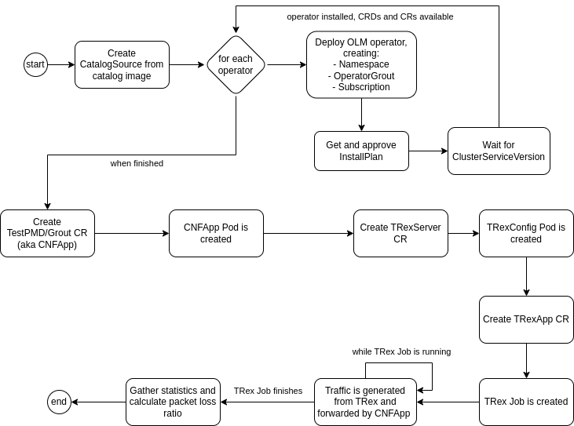

# Testing Example CNF

In this document, we will show you how to test Example CNF using [Distributed-CI (DCI)](https://docs.distributed-ci.io/).

For this to work, we will assume that we have an OCP cluster up and running that meets the [pre-requirements](../README.md#pre-requirements) to launch Example CNF, and that all DCI tools (`dci-openshift-agent`, `dci-openshift-app-agent` and `dci-pipeline`) are installed in a jumphost server which has access to the OCP cluster.

You can use the Ansible playbooks and roles at <https://github.com/redhatci/ansible-collection-redhatci-ocp/blob/main/roles/example_cnf_deploy/README.md> to automate the use of the Example CNF.

## Pipeline configuration

To deploy Example CNF, we will use [`dci-pipeline` tool](https://blog.distributed-ci.io/dci-pipeline.html), with the following pipeline configuration (this corresponds to the [baseline scenario](#baseline-scenario) we will present later on, but can be used as base for the rest of scenarios):

```
$ cat example-cnf-pipeline.yml
---
- name: example-cnf
  stage: workload
  prev_stages: [openshift-upgrade, openshift]
  ansible_cfg: /usr/share/dci-openshift-agent/ansible.cfg
  ansible_playbook: /usr/share/dci-openshift-app-agent/dci-openshift-app-agent.yml
  ansible_inventory: /etc/dci-openshift-app-agent/hosts.yml
  configuration: "myqueue"
  dci_credentials: ~/.config/dci-pipeline/credentials.yml
  ansible_extravars:
    dci_cache_dir: /var/lib/dci-pipeline
    dci_tags:
      - debug

    # Including example-cnf hooks
    dci_config_dir: /usr/share/example-cnf-config/testpmd
    dci_gits_to_components:
      - /usr/share/example-cnf-config

    # Do not delete resources when the job finishes
    dci_teardown_on_success: false
    dci_teardown_on_failure: false

    # Point to SRIOV config
    example_cnf_sriov_file: /usr/share/mycluster-sriov-config.yml

    # Tune example-cnf execution
    ## Allow testpmd in reduced mode
    ecd_testpmd_reduced_mode: 1
    ## Tune TRexApp parameters
    ecd_trex_duration: 120
    ecd_trex_packet_rate: 2mpps
    ecd_trex_packet_size: 64

    # Allow failures in TRex jobs in case we have packet loss because of the data rate we're generating
    example_cnf_skip_trex_job_failure: true

  use_previous_topic: true
  components:
    - nfv-example-cnf-index
  inputs:
    kubeconfig: kubeconfig_path
```

From this pipeline, we can extract the following information:

- Example CNF is launched on top of a running OpenShift cluster, using `dci-openshift-app-agent` as main Ansible automation.
- Example CNF hooks are downladed in the jumphost from [example-cnf-config](https://github.com/dci-labs/example-cnf-config/tree/master/testpmd) repository, under `/usr/share` folder.
- The deployment is not removed when the DCI job finishes.
- SRIOV config is provided in a YAML file like this one (previously, you would have needed to configure your network to match that configuration in your cluster, so that the worker node's interfaces have the given VLAN configured):

```
$ cat mycluster-sriov-config.yml
---
sriov_network_configs:
  - resource: example_cnf_res1
    node_policy:
      name: example-cnf-policy1
      device_type: vfio-pci
      is_rdma: false
      mtu: 9000
      nic_selector:
        device_id: 158b
        pf_names:
          - ens7f0#0-7
        vendor: "8086"
      node_selector:
        node-role.kubernetes.io/worker: ""
      num_vfs: 16
      priority: 99
  - resource: example_cnf_res2
    node_policy:
      name: example-cnf-policy2
      device_type: vfio-pci
      is_rdma: false
      mtu: 9000
      nic_selector:
        device_id: 158b
        pf_names:
          - ens7f0#8-15
        vendor: "8086"
      node_selector:
        node-role.kubernetes.io/worker: ""
      num_vfs: 16
      priority: 99
  - resource: example_cnf_res1
    network:
      name: example-cnf-net1
      network_namespace: example-cnf
      spoof_chk: "off"
      trust: "on"
      vlan: 3801
      capabilities: '{"mac": true}'
  - resource: example_cnf_res2
    network:
      name: example-cnf-net2
      network_namespace: example-cnf
      spoof_chk: "off"
      trust: "on"
      vlan: 3802
      capabilities: '{"mac": true}'
```

- Fine tune the parameters for the tests to be launched. We can configure here the following:

  - `ecd_testpmd_reduced_mode`: default value is 0. If it's different than 0, it allows Example CNF to use the reduced mode in the [testpmd-wrapper](../testpmd-container-app/cnfapp/scripts/testpmd-wrapper) script, where only three cores are used on testpmd, and txd/rxd parameters are doubled.
  - `ecd_trex_duration`: default value is 120. It is the duration of the TRex run. If setting -1, TRex will run on continuous burst mode. If setting any value here, TRex job will be stopped once this time is reached. This may imply packet loss if using a high packet rate.
  - `ecd_trex_packet_rate`: default value is 10kpps. It is the packet rate used by TRex to send traffic, expressed in packets per second (pps). Units are defined in lower case, so 2mpps means 2 megapackets per second (2.000.000 packets/s).
  - `ecd_trex_packet_size`: devault value is 64. It is the size of the packets sent by TRex, in bytes. This value, combined with the packet rate, allows you to determine the throughput that is injected by TRex. For example, with 64 B and 2mpps, we would have around `64*8*2*10^6 = 1 Gbps`.
  - `example_cnf_skip_trex_job_failure`: default value is false, but since it may happen that, after reaching the duration timeout, there are still packets that are being sent (mostly if using a high throughput, closer to the link data rate), Example CNF may detect packet loss in that case and make the DCI job to fail. To avoid that effect, you can set this parameter to true.

## Baseline scenario

The baseline scenario corresponds to this workflow (other scenarios are modifications taken from this baseline workflow):



You can run it with this command:

```
$ export KUBECONFIG=/path/to/mycluster/kubeconfig
$ DCI_QUEUE_RESOURCE=mycluster dci-pipeline-schedule example-cnf
```

This is an example of a [job](https://www.distributed-ci.io/jobs/57ec2b12-f450-436e-961e-b19912cadb21/jobStates) launched with this pipeline.

> This job launches more test cases, related to Red Hat certification, that are out of the scope of this documentation.

### Check the pods

We can check the pods that have been created after launching the pipeline:

```

```

## Troubleshooting mode scenario

The baseline scenario is a good option to be able to launch Example CNF operators and deploy TRex automatically, being suitable for a CI system loop where the tests are executed N times and then we can extract conclusions from all the results obtained. However, we cannot really interact with either TestPMD or TRex.

To achieve this goal, we can run Example CNF in troubleshooting mode by just providing some extra parameters to `dci-pipeline-schedule` call. In this way, all Example CNF operators will be created and all pods will keep up and running with all scripts prepared for being launched, but the automation will not take care of launching the test scripts and creating the TRex job, so that we can interact with both TestPMD and TRex to check on-line the behavior and results.

You can launch this scenario with the following call to `dci-pipeline-schedule`:

```
$ export KUBECONFIG=/path/to/mycluster/kubeconfig
$ DCI_QUEUE_RESOURCE=mycluster dci-pipeline-schedule example-cnf
```

Here's a [DCI job example](https://www.distributed-ci.io/jobs/67fec9f4-8629-4ca9-8c8f-54ce2e7e85db/jobStates?sort=date) with this troubleshooting mode execution.

### Check pods

TBD - https://docs.google.com/document/d/1H2ckIk1OaCFcEdjxFin5QcYf-qpmvEqwJvUUZt4sWIc/edit?tab=t.0#heading=h.63hal0xqwm0t

## Draining scenario

### Manual testing

TBD - https://docs.google.com/document/d/1DDZubnc16FCLPb8xNF2ybWhVbU3q366KmkITa2q1cFQ/edit?tab=t.0#heading=h.63hal0xqwm0t

### Automation

## Test Example CNF during upgrades

## Create a new TRexApp job

## Remove Example CNF deployment

You can use the same pipeline from the [baseline scenario](#baseline-scenario) to remove Example CNF from your cluster, in case you didn't set `dci_teardown_on_success|failure` variables to true.

You can do it with the following call to `dci-pipeline-schedule`:

```
$ export KUBECONFIG=/path/to/mycluster/kubeconfig
$ DCI_QUEUE_RESOURCE=mycluster dci-pipeline-schedule example-cnf
```

Here's a [DCI job example](https://www.distributed-ci.io/jobs/22a50cd0-6bc6-439c-94af-e401ca467962/jobStates?sort=date) with this cleanup execution.
