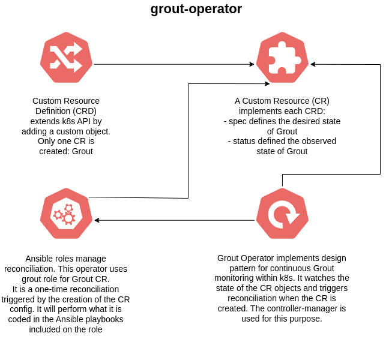

# grout-operator



Final application, also known as CNF Application, which is composed by Grout, which uses DPDK for L3 forwarding. It uses two components:

- Grout CR, which creates a pod to implement the L3 forwarding as final application. Related pod is `grout-app-<x>` pod (only one replica is used).
- Grout Operator, ensuring CR reconciliation via controller-manager pod. Related pod is `grout-operator-controller-manager-<x>` pod.

The following information can be extracted from pod logs:

- To see the Grout statistics printed periodically for this module, you can rely on `grout-app-<x>` pod logs.
- In `grout-operator-controller-manager-<x>` pod, you can see the execution of the Ansible playbooks that ensures the reconciliation loop of the operator.

## How to build the operator

Base structure is achieved with the following commands, then it's just a matter of accommodating the required code for the operator in the corresponding files and folders:

```
$ mkdir grout-operator; cd grout-operator
$ operator-sdk init --domain openshift.io --plugins ansible
$ operator-sdk create api --version v1 --generate-role --group examplecnf --kind Grout
```

## What to update if bumping operator version

Apart from the modifications you have to do, you also need to update the operator version in these files:

- [CHANGELOG.md](CHANGELOG.md).
- [Makefile](Makefile).
- [Dockerfile](Dockerfile).

Also, make sure that the operator version is within the interval defined in [required-annotations.yaml](../utils/required-annotations.yaml) file for `olm.skipRange` annotation, else update that file to modify the current range.

A common change is the update of Operator SDK version used in the operator. Here's an [example](https://github.com/openshift-kni/example-cnf/pull/108) where this is done.
