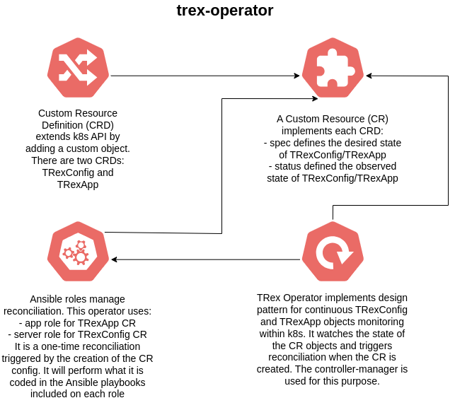

# trex-operator



It provides TRex Traffic Generator, decomposed in three components:

- TRexConfig CR, pinning the config of the TRex server instance. Related pod is `trexconfig-<x>` pod.
- TRexApp CR, setting up the job that launches TRex execution to generate traffic towards the system under test. Related pod is `trex-app` pod.
- TRex Operator, ensuring CR reconciliation via controller-manager pod. Related pod is `trex-operator-controller-manager-<x>` pod.

Following information can be extracted from pod logs:

- In `trexconfig-<x>` pod logs, you can see the trex statistics printed periodically.
- The summary of the test execution can be seen at the end of the `trex-app` job logs.
- In `trex-operator-controller-manager-<x>` pod, you can see the execution of the Ansible playbooks that ensures the reconciliation loop of the operator.

## How to build the operator

Base structure is achieved with the following commands, then it's just a matter of accommodating the required code for the operator in the corresponding files and folders:

```
$ mkdir trex-operator; cd trex-operator
$ operator-sdk init --domain openshift.io --plugins ansible
$ operator-sdk create api --version v1 --generate-role --group examplecnf --kind TRexApp
$ operator-sdk create api --version v1 --generate-role --group examplecnf --kind TRexConfig
```

## What to update if bumping operator version

Apart from the modifications you have to do, you also need to update the operator version in these files:

- [CHANGELOG.md](CHANGELOG.md).
- [Makefile](Makefile).
- [Dockerfile](Dockerfile).

Also, make sure that the operator version is within the interval defined in [required-annotations.yaml](../utils/required-annotations.yaml) file for `olm.skipRange` annotation, else update that file to modify the current range.

A common change is the update of Operator SDK version used in the operator. Here's an [example](https://github.com/openshift-kni/example-cnf/pull/108) where this is done. The step-by-step migration plan typically implies the following tasks:

1. Update Operator SDK version in Makefile and Dockerfile
2. Simplify Makefile by updating custom variables
3. Add modern operator-sdk download targets
4. Update Dockerfile to use newer base image
5. Test the operator to ensure compatibility
6. Update any CI/CD that depends on the old Makefile targets
